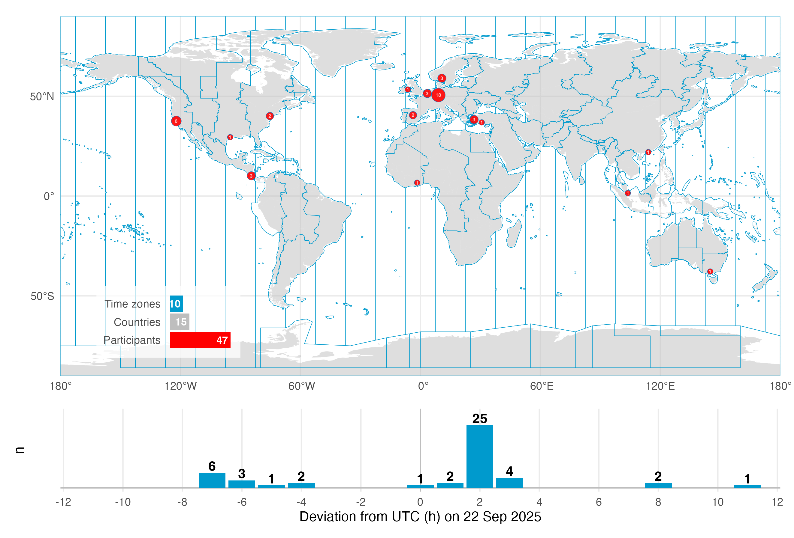
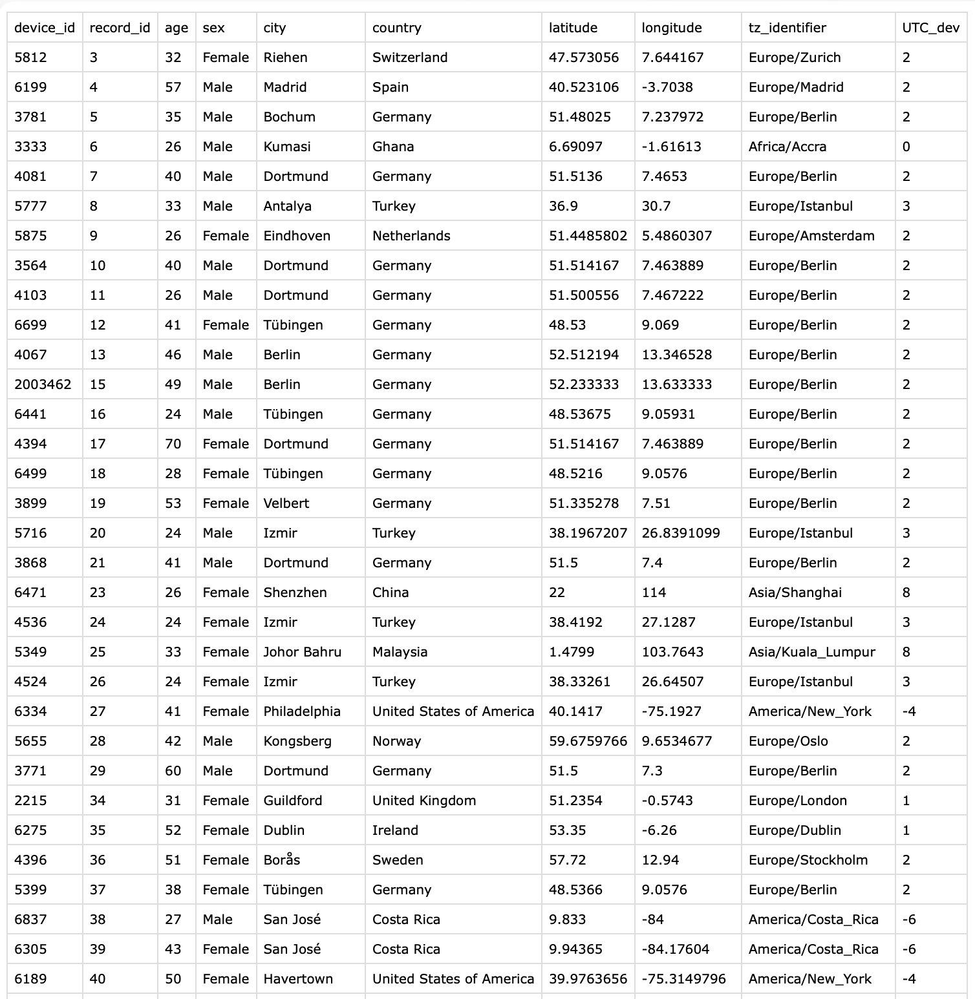



```{r}
#| echo: false
live <- "advanced_01_a_day_in_daylight-live.qmd"
static <- "advanced_01_a_day_in_daylight.qmd"
```

## Preface

On the September 2025 equinox, over 50 participants across the globe logged and annotated their daily light exposure. While not a (traditional) study, the data is extraordinarily well suited to explore a diverse dataset across many participants in terms of geolocation, device-type, and contextual information, as participants logged their statechanges via a smartphone application. The dataset were analysed and presented as part of the *A Day in Daylight* event on 3 November 2025. They can be explored in an [interactive dashboard](https://tscnlab.github.io/2025_ADayInDaylight/). For this use case, we will take a subset of the datasets to explore workflows for these conditions, and summarize the data by combining it with activity logs and participant demographics.



The tutorial focuses on

- setting up the import from multiple devices and time zones

- handling multiple time zones once the data is imported

- handling a large number of participants in a study

- adding to and analysing participant-specific data (sex, age,…)



**Note that we will use a reduced dataset for the `live` tutorial of 10 participants for the wearable data.**

## Setup

We start by loading the necessary packages.

```{webr}
#| label: setup
#| eval: false
library(LightLogR) # main package
library(tidyverse) # for tidy data science
library(gt) # for great tables
library(legendry) # for advanced plot axes
library(glue) # for easier label creation
```

## Import

::: {.callout-note}
Import works differently in this use case, because we import from different time zones and also devices. Would all devices be the same, or would the recordings have all happened in a single time zone, we would simply bulk import with `import$device(files, tz)`
:::

### Participant data

First, we collect a list of available data sets. Data are stored in the folder `data/a_day_in_daylight/lightloggers/`.

```{webr}
#| label: light datasets
path_light <- "data/a_day_in_daylight/lightloggers/"
files_light <- 
  path_light |> 
  list.files() |> #<4>
  tools::file_path_sans_ext() #<5>
files_light
```

4. List the filenames from the folder

5. remove file extenstions (`.txt`)

Next we check which devices are declared in the participant metadata collected via a REDCap survey. We want to compare whether the device id's from the file names match with the survey. @fig-participants shows the structure of the CSV file.

{#fig-participants}

```{webr}
#| label: survey devices
participant_data <- read_csv("data/a_day_in_daylight/participant_metadata.csv")
survey_devices <- participant_data |> pull(device_id) #<2>
```

2. Collect device id's from survey

```{webr}
survey_devices |> anyDuplicated() #<1>
all(files_light %in% survey_devices) #<2>
```

1. Check whether any entries are duplicated

2. Check whether all wearable files are represented in the survey

Before we import the wearable data, let's make a plot of participants' age(group) and sex.

### Plot demographic data

First, we create a helper for the axis to indicate the sexes.

```{webr}
#| label: sex axis
#| autorun: true
sex_lab <- primitive_bracket(
  key  = key_range_manual(
    start = c(-7,0), 
    end = c(0,7),
    name     = c("Males", "Females"),
    level = 1
  ),
  position = "bottom"
)
print("already executed")
```

Then we create the actual plot:

```{webr}
#| label: sex and gender distribution
#| fig-width: 5
#| fig-height: 4
participant_data |>  
  mutate(
         age_group = #<1>
           cut(age, #<1>
               breaks = seq(20,70,5), #<1>
               labels = paste(4:13*5+1, 5:14*5, sep = "-"), #<1>
               right = TRUE, #<1>
               ordered_result = TRUE), #<1>
         ) |> 
  summarize(n = n(), .by = c(sex, age_group)) |> #<2>
  uncount(n) |> #<3> 
  mutate(unit = row_number() - 0.5, 
         unit = if_else(sex == "Male", -unit, unit),
         .by = c(sex, age_group)) |>
  mutate(n = ifelse(sex == "Male", -1, 1)) |> #<4>
  ggplot(aes(y= age_group, x = unit, fill = sex)) + 
  geom_tile(col = "white", lwd = 1) +
  geom_vline(xintercept = 0) +
  scale_x_continuous(breaks = seq(-6,6, by = 2), 
                     labels = c(6, 4, 2, 0, 2, 4, 6)) +
  scale_fill_manual(values = c(Male = "#2D6D66", Female = "#A23B54")) + 
  guides(fill = "none", alpha = "none",
         x = guide_axis_stack(
           "axis", sex_lab
         )) +
  cowplot::theme_cowplot() +
  coord_equal(xlim = c(-7, 7), expand = FALSE) +
  labs(y = "Age (yrs)", x = "n")
```

1. Convert age into age groups (length of five years)

2. Get the number of participants per age group and sex

3. Replicate each row n times

3. Change sign for males' n

### Import wearable data

Next, we import the light data. We do this inside `participant_data`. If you are not used to `list` columns inside dataframes, do not worry - we will take this one step at a time.

There are two devices in use: `ActLumus` and `ActTrust`. We need to import them separately, as they are using different file formats and thus import functions. In our case, `device_id` with four numbers indicates an `ActLumus` device, whereas seven numbers indicates an `ActTrust`. We add a column to the data indicating the Type of device in use. We also make sure that the spelling equals the `supported_devices()` list from `LightLogR`. Then we construct filename paths for all files.

```{webr}
all(c("ActLumus", "ActTrust") %in% supported_devices())
```

```{webr}
#| label: collect wearable info
data <- 
participant_data |> 
  mutate(
    device_type = case_when(str_length(device_id) == 4 ~ "ActLumus",
                            str_length(device_id) == 7 ~ "ActTrust"
                            ),
    file_path = glue("data/a_day_in_daylight/lightloggers/{device_id}.txt")
    ) |> 
  semi_join(tibble(device_id = files_light |> as.numeric())) #<9>

data |> 
  select(device_id, tz_identifier, device_type, file_path) |> 
  gt()
```

9. Only select participants which are part of the reduced `live` dataset.

With this information we import our datasets into a column called `light_data`. Because this is going to be a list-column, we use the `map` family of functions from the `{purrr}` package, as they output a list for each input. Input, in our case, it the `device_type`, `file_path`, and `tz_identifier` in each row. Because the file names contain nothing but the Id, we don't have to specify anything to the import function regarding `Id`, as the filename will be used by default.

For the next code cells we have eased the `timelimit` restriction that are normally set for `webR` (30 seconds), as this will take some time.

```{webr}
#| label: import files
#| timelimit: 0
data <- 
data |> 
  mutate(
    light_data = 
      pmap( #<5>
        list(x = device_type, y = file_path, z = tz_identifier), #<6>
                       \(x, y, z) { #<7>
                         import_Dataset(device = x, #<8>
                                        filename = y, #<9>
                                        tz = z, #<10>
                                        silent = TRUE) #<11>
                       } #<12>
    )
  )
print("Import finished")
```

5. `pmap()` takes a list of arguments, provides them row-by-row to a function, and outputs a list of results. 

6. Inputs to our import function. In our case, because we are using the `pmap()` inside `mutate`, we can directly reference the dataset variables. 

7-12. The function we want to be executed based on the inputs

8-11. `LightLogR`'s import function. We provide the arguments in the correct spot. Because we do not want to have 47 individual summaries and overview plots, we set the import to silent.

We end with one dataset per row entry. Let us have a look.

```{webr}
data$light_data[[1]] |> gg_days()
data$light_data[[10]] |> gg_days()
```

What about the import summary? We can still import the data the normal way (at least for one device type) - while they will all share the same time zone, it can still be used to get some initial insights about the data.

```{webr}
#| label: manual import
#| fig-height: 3
#| fig-width: 5
#| timelimit: 90
data |> 
  filter(device_type == "ActLumus") |> #<2>
  slice(-5) |> #<3>
  pull(file_path) |> 
  import$ActLumus() |> #<5>
  invisible() #<6>
```

2. Select only participants with the `ActLumus` device

3. Remove file that has a differing number of columns from the others. Likely, this is due to a software export setting. Importing this file separately would not be an issue, just the mix is not possible.

5. Import function with standard settings

6. we are not interested in the actual data, just the side effect of the import summary.

## Light data

### Cleaning light data

In this section we will prepare the light data through the following steps:

- resampling data to 5 minute intervals

- filling in missing data with explicit gaps

- removing data that does not fall between `2025-09-21 10:00:00 UTC` and `2025-09-23 12:00:00 UTC`, which contains all times where 22 September occurs *somewhere* on the planet

- creating a `local_time` variable, which forces the `UTC` time zone on all time stamps. When we later merge all datasets, we will have `Datetime` to compare based on real-time measurements, and `local_time` to compare based on time of day.

- adding photoperiod information to the data. It will use the `local_time` variable as a basis

We do this the same way as we imported individual files above, with the `pmap` function. 

**Note: the next code cell will date considerable time**

```{webr}
#| label: Cleanup of light data
#| timelimit: 0
data <-
  data |>
  mutate(
    light_data = 
      pmap(list(light_data, latitude, longitude), 
                  \(x, lat, lon) {
    x |>
      aggregate_Datetime("5 mins") |> #<8>
      gap_handler(full.days = TRUE) |> #<9>
      filter_Datetime(start = "2025-09-21 10:00:00", #<10>
                      end = "2025-09-23 12:00:00", #<11>
                      tz = "UTC") |> #<12>
      mutate(local_time = force_tz(Datetime, "UTC"), .before = Datetime) |> #<13>
      add_photoperiod(c(lat, lon)) |>  #<14>
      mutate(across(c(dusk, dawn), \(x) force_tz(x, "UTC"))) #<15>
  }))
data$light_data[[1]]
```

8. Resample to 5 mins

9. Fill in explicit gaps

10-12. Only leave a section of data

13. Adding a `local_time` colum

14-15. Adding photoperiod information and forcing it to the same time zone as `local_time`.

### Visualizing light data

Now we can visualize the whole dataset - first by combining all datasets. There are two ways how to get to the complete dataset. First by joining only the wearable datasets:

```{webr}
#| label: combine light data 1
#| warning: false
  join_datasets(!!!data$light_data) #<1>
```

1. The `!!!data$light_data` is basically equivalent to `data$light_data[[1]], data$light_data[[2]],...`

Or, and we use this method here, by unnesting the `light_data` in the `data` frame. While it requires a manual regrouping by `Id`, it has the added benefit, that all the participant data is kept with the wearable data.

```{webr}
#| label: combine light data 2
#| warning: false
light_data <- data |> unnest(light_data) |> group_by(Id)
light_data
```

::: {.callout-note}
Note that we are working with two different devices, which export different variables, and also have different measurement qualities. In our specific case, both output a `LIGHT` variable that denotes photopic illuminance. We thus will use this variable to analyse light in this use case.

In a really study, however, mixing devices would have to be a far more deliberate step, and include some custom calibration.
:::

Here are some overviews of the data. With `gg_overview()`:

```{webr}
#| fig-height: 3
#| fig-width: 7
light_data |> gg_overview(local_time) #<1>
light_data |> gg_overview() #<2>
```

1. Overview based on `local_time`

2. Overview based on `real_time` (Datetime)

With `summary_overview()`:

```{webr}
light_data |> 
  summary_overview(LIGHT, Datetime.colname = local_time) |> 
  gt() |> 
  sub_missing() |> 
  fmt_number()
```

And with `summary_table()`

```{webr}
#| eval: false
light_data |> 
  summary_table(Variable.colname = LIGHT, 
                Datetime.colname = local_time,
                Variable.label = "Photopic illuminance (lx)",
                color = "red")
```

](assets/advanced/01_tbl_summary.png)

What are the timezones of our two datetime columns now? Let´s find out

```{webr}
light_data |> 
  ungroup() |>
  summarize(tz_Datetime = tz(Datetime),
            tz_local_time = tz(local_time)
            )
```

Why is that? `local_time` can be expected, we set it ourselves above. But why is `Datetime` now converted to `Europe/Zurich`. Looking at the first row of the participant data, we see that this is the time zone of the first participant:

```{webr}
participant_data |> slice_head() |> pull(tz_identifier)
```

When merging multiple time zones, the first time zone will be the one all others are converted to. It helps to remember that the underlying data does not change! Time-zone settings merely change the representation of the time points, not their position in time. The same way that a bar of length 254 mm can be expressed as 10 inches, without it changing the length of the bar. But because the first time zone of the participant list is very arbitrary, we will convert it to `UTC` as well. Instead of `force_tz()`, which changes the underlying time point, we use `with_tz()`, which simply changes the representation. Note that this change is merely cosmetic, i.e., it influences what you see when looking at the data in R. All calculations with that variable would be the same either way.

```{webr}
light_data <- 
  light_data |> 
  mutate(Datetime = with_tz(Datetime, "UTC"))
#rechecking:
light_data |> 
  ungroup() |>
  summarize(tz_Datetime = tz(Datetime),
            tz_local_time = tz(local_time)
            )
```


Then we create border points for the period of interest - start and end points in real time (`rt`), and in local time (`lt`), respectively.

```{webr}
#| label: period of interest
#| warning: false
#| autorun: true
start_rt <- as.POSIXct("2025-09-21 10:00:00", tz = "UTC")
start_lt <- as.POSIXct("2025-09-22 00:00:00", tz = "UTC")
end_rt <- as.POSIXct("2025-09-23 12:00:00", tz = "UTC")
end_lt <- as.POSIXct("2025-09-23 00:00:00", tz = "UTC")
print("already executed")
```

Then we plot all the datasets. The resulting figure below shows how they relate in real time.

```{webr}
#| label: fig-rt
#| warning: false
light_data |> 
  aggregate_Datetime("1hour") |> 
  gg_days(LIGHT,
          facetting = FALSE, 
          group = Id, 
          geom = "ribbon",
          lwd = 0.25,
          fill = "skyblue3",
          color = "skyblue4",
          alpha = 0.1,
          x.axis.label = "Real time",
          y.axis.label = "Illuminance (lx)"
          ) +
  geom_vline(xintercept = c(start_rt, end_rt), color = "red")
```

The next figure shows how they relate in local time, and also include a photoperiod indicator at the bottom.

```{webr}
#| label: fig-lt
#| warning: false
light_data |> 
  aggregate_Datetime("1hour") |>
  gg_days(LIGHT, #<3>
          x.axis = local_time, #<4>
          geom = "ribbon",
          facetting = FALSE,
          fill = "skyblue3",
          color = "skyblue4",
          alpha = 0.1,
          group = Id, 
          lwd = 0.25,
          x.axis.label = "Local Time",
          y.axis.label = "Illuminance (lx)"
          ) |> 
  gg_photoperiod(alpha = 0.1, Datetime.colname = local_time, ymax = 0) + #<15>
  geom_vline(xintercept = c(start_lt, end_lt), color = "red")
```

3. Replacing the default `MEDI` with our `LIGHT` variable that is available across all device types.

4. Setting the `x.axis` to the `local_time`

15. We also need to provide the deviating `Datetime.colname` for the photoperiods, otherwise the calculation of the average `dusk` and `dawn` by date will be erroneous. 

We can further create a small function that takes an indice and provide the realtime and localtime display of the dataset.

```{webr}
#| autorun: true
shift_plot <- function(group) {
light_data |> 
  sample_groups(sample = group) |> #<3>
  gg_days(LIGHT,
          x.axis = Datetime,
          color = "skyblue4",
          group = Id, 
          x.axis.label = "Datetime",
          y.axis.label = "Illuminance (lx)"
          ) |> 
  gg_photoperiod(Datetime.colname = local_time) +
    geom_line(aes(x = local_time), col = "red") +
  geom_vline(xintercept = c(start_lt, end_lt), color = "red") +
    labs(title = "Local time (red) vs. real time (blue)")
}
print("already executed")
```

3. `sample_groups()` is a convenient way to select groups

```{webr}
#| warning: false
#| fig-height: 6
shift_plot(8:10)
```

## Time above threshold

In this section we calculate the time above threshold for the single day of `22 September 2025`, depending on latitude and country. We require the `local_time` variable for that. Because we unnested the data into the participant data, that information is available to us.

```{webr}
#| label: Time above 250 lx mel EDI across participants
TAT250 <- 
light_data |> 
  filter_Date(start = "2025-09-22", #<3>
              length = "1 day", #<4>
              Datetime.colname = local_time) |> #<5>
  dplyr::summarize(
    duration_above_threshold( #<7>
      LIGHT, local_time, threshold = 250, na.rm = TRUE, #<8>
      as.df = TRUE #<9>
    ),
    latitude = first(latitude), #<11>
    longitude = first(longitude), #<12>
    country = first(country) #<13>
  ) |> 
  mutate(n = n(), .by = country) #<15>

TAT250
```

3-5. We reduce the length of the dataset

7-9. We calculate time above 250 lx

11-13. Extracting coordinates and country

15. Calculating how often a country is represented

We plot this information with a custom function, which lets us quickly exchange latitude and longitude.

```{webr}
#| autorun: true
TAT250_plot <- function(value){
TAT250 |> 
  ggplot(
    aes(
      x= fct_reorder(Id, duration_above_250), #<5>
      y = duration_above_250))+
  geom_col(aes(fill = {{ value }})) +
  scale_fill_viridis_b(labels = \(x) paste0(x, "°"))+
  scale_y_time(labels = style_time, #<9>
               expand = FALSE) + 
  theme_minimal() +
  theme_sub_axis_x(text = element_blank(), line = element_line()) +
  theme_sub_panel(grid.major.x = element_blank())+
  labs(x = "Participants", y = "Time above 250lx (HH:MM)")
}
print("already executed")
```

5. Ordering the output by their time above 250lx

9. `style_time()` is a `LightLogR` convenience function that produces nice time labels

```{webr}
TAT250_plot(latitude) |> plotly::ggplotly() #<1>
```

1. Making the plot interactive

Next we display the metric by country. Because the individual variance of these data is very high, we also choose to add information about the number of individuals within a country.

```{webr}
#| label: Time above 250 lx mel EDI across countries
TAT250 |> 
  ggplot(
    aes(
      y= fct_reorder(country, duration_above_250), 
      x = duration_above_250))+
  geom_boxplot(aes(col = n)) +
  scale_color_viridis_b(right = FALSE, nice.breaks = TRUE)+
  scale_x_time(labels = style_time) + 
  theme_minimal() +
  theme_sub_panel(grid.major.y = element_blank())+
  labs(y = NULL, x = "Time above 250lx (HH:MM)")
```

## Event data

The last major aspect we will cover in this use case, are the activity logs that participants filled in, whenever their status changed - be it whether they took off their device, changed location, activity, or switched light settings. The activity logs are available as an R object here, this has the benefit that variable labels are retained.

::: {.callout-important}
### On the order of including wear-information

In a regular analysis, we would use the non-wear information at hand before we calculated any metrics as we did in the prio sections. For this online course, however, we set the order of aspects also after didactic aspects. We want to close with this aspect here, as the activity logs are quite complex. Normally, the non-wear information would be added (and those times excluded) much earlier.
:::

We start by loading in the logs and display a small portion:

```{webr}
load("data/a_day_in_daylight/events.RData")
dim(events)
events <- events |> as_tibble()
events |> slice_head(n = 5) |> gt()
```

`startdate` marks the local time when an activity was logged. As per the instructions, it should be valid until the next activity is logged. This allows us to put `start` and `end` timepoints to each row.

```{webr}
events <-
  events |> 
  dplyr::mutate(
    start = as.POSIXct(startdate, tz = "UTC"), #<4>
    status.duration = c(diff(start), NA_real_), #<5> 
    end = case_when( #<6>
              is.na(lead(start)) ~ (start + dhours(6)), #<7>
              .default = start + status.duration #<8>
              ), #<9>
    setting_light = case_when(type == "Bedtime" ~ "Bed", #<10>
                              type == "Non-wear" ~ "Non-wear", #<11>
                              .default = setting_light |> as.character()) |> #<12>
                    factor(levels = #<13>
                           c("Bed", "Indoors", "Mixed", "Outdoors", "Non-wear") #<14>
                           ), #<15>
    record_id = as.numeric(record_id), #<16>
    .by = record_id, #<17>
    .after = startdate) |> 
  left_join(participant_data |> select(device_id, record_id), by = "record_id") |> #<19>
  rename(Id = device_id) |> #<20>
  mutate(Id = factor(Id)) |> #<21>
  semi_join(data, by = "record_id") #<22>
events
```

4. The start variable is already presend, but it is a `character` string and needs to be converted to a datetime

5. The duration of a status is the difference of consecutive time points. Because the last log entry does not have a lead, we need to add a missing value at the end.

6-9. For the end, we differentiate between cases where there is no next entry - in those cases, we simply define the length as until the end of data collection. To cover this time span, it is safe to assume a duration of six hours. The end will be automatically capped to the end of the wearable data, when we merge it later on. In cases where there is a next entry, we use the start of the next log entry as an endpoint.

10-15. Creating a general setting that differentiates between the main states

16. We need to add the `device_id` to the event data, the link is the `record_id`, which needs to be numeric for line 19

17. All the operations above need to be performed on a by-participant fashion

19-21. Adding `device_id`. For the merge, it needs to a factor `Id`, which is the grouping variable in `light_data`

22. Removing all `record_id`'s that are not part of `data`

To get a feeling for the event data, lets make some summaries.

```{webr}
names(events)
```

```{webr}
events |> 
  group_by(record_id) |> 
  summarize(n = n()) |> 
  summarize(participants = n(),
            mean_n_logs = mean(n) |> round(),
            min_n_logs = min(n),
            max_n_logs = max(n)) |>
  gt()
```

So a total of 10 participants collected on average 36 log entries (at minimum 19, at maximum 66)

Then we can summarize the general conditions in the following table. None of the following code cell functions are using `LightLogR`, but feel free to explore what each one does anyways.

```{webr}
#| label: table summary
events |> 
  dplyr::summarize(`Daily duration` = sum(status.duration, na.rm = TRUE),
                   .by = c(setting_light, record_id)) |> 
  dplyr::summarize(`Daily duration` = mean(`Daily duration`),
                   .by = c(setting_light)) |> 
  dplyr::mutate(`Daily duration` =
                  `Daily duration` /
                  sum(as.numeric(`Daily duration`)) *
                  24*60*60,
                Percent = 
                  (as.numeric(`Daily duration`)/
                  sum(as.numeric(`Daily duration`)))
                ) |> 
  arrange(setting_light) |> 
  gt(rowname_col = "setting_light") |> 
  grand_summary_rows( 
                     fns = list(
      sum ~ sum(.)
    ),
    fmt = list(~ fmt_percent(., columns = Percent, decimals = 0), 
               ~ fmt_duration(., columns = `Daily duration`, 
               input_units = "secs",
               max_output_units = 3))
    ) |> 
  fmt_duration(`Daily duration`, 
               input_units = "secs",
               max_output_units = 2) |> 
  fmt_percent(columns = Percent, decimals = 0) |> 
  sub_missing() |> 
  tab_header(title = "Mean daily duration in condition")
```

### Combining Events with light data

In this step, we expand the light measurements with the event data.

```{webr}
#| label: combining light and log data
light_data <-
light_data |> 
  select(
    device_id:Datetime, local_time, LIGHT, 
    dawn, dusk, photoperiod, photoperiod.state) |> 
  add_states(events, Datetime.colname = local_time) #<6>
light_data |> names()
```

6. To properly add the states information, we need to select the `local_time` variable

Next, we can visualize the activity logs together with the light information. To facilitate this, we again create a helper function. This opens a whole range of options to explore participants and states

```{webr}
#| label: plotting light data
#| autorun: true
state_plot <- function(variable, sample) {
light_data |>
    sample_groups(sample = sample) |> 
  gg_days(LIGHT, 
          x.axis = local_time,
          y.axis.label = "Photopic illuminance (lx)") |>
    gg_photoperiod(Datetime.colname = local_time) |> 
  gg_state({{ variable }}, aes_fill = {{ variable }}, alpha = 1, ymax = 0) +
    theme_sub_legend(position = "bottom")
}
print("already executed")
```


```{webr}
#| warning: false
#| message: false
#| fig-width: 10
state_plot(setting_light, 6:7)
```


```{webr}
#| fig-width: 10
state_plot(type, 7)
```


```{webr}
#| fig-width: 10
state_plot(setting_indoors, 6)
```

### Remove non-wear

As we now have logs of non-wear (both during the day and in sleep), we can set those measurements to `NA`. Before that, let's check what the average value is during each state:

```{webr}
light_data |> 
  group_by(type) |>
  summarize(mean = mean(LIGHT, na.rm = TRUE))
```

Now let's remove these measurements.

```{webr}
light_data <-
  light_data |> 
  mutate(LIGHT = case_match(as.character(type),
                            c("Non-wear", "Bedtime") ~ NA_real_,
                            .default = LIGHT))
print("already executed")
```

We can check whether we were successful, by summarizing our data depending on `type`.

```{webr}
light_data |> 
  group_by(type) |>
  summarize(mean = mean(LIGHT, na.rm = TRUE))
```

This shows us that removing those instances was successful. To close up this use case, we can calculate a few metrics depending on the context with a helper function:

```{webr}
#| autorun: true
quick_summaries <- function(variable) {
light_data |> 
  group_by({{ variable }}, .add = TRUE) |>
    durations(LIGHT, show.missing = TRUE, FALSE.as.NA = TRUE) |> #<4>
    ungroup(Id) |>
    summarize_numeric(prefix = "mean_per_participant_") |> #<6>
    extract_metric( #<7>
      light_data |> #<8>
        mutate({{ variable }} := factor({{ variable}})) |> #<9>
        group_by({{ variable }} #<10>
                 ), #<11>
      identifying.colname = {{ variable }}, #<12>
      Datetime.colname = local_time, #<13>
      geo_mean = log_zero_inflated(LIGHT) |> #<14>
             mean(na.rm = TRUE) |> #<15>
             exp_zero_inflated() #<16>
      ) |> #<17>
    rename(participants = episodes) |> 
    drop_na() |>
    gt() |>
    fmt_number(geo_mean)
}
print("already executed")
```

4. Calculate the duration of every state for each participant

6. Calculate the average duration per state across participants

7-17. We add the geometric mean to the summary with `extract_metric`, and supply the original dataset, grouped in the same way as our summary is

12-13. Secondary settings

14-16. The formula for the geometric mean uses `log_zero_inflated()` and its counterpart `exp_zero_inflated()` to allow for zero-lx values in the dataset

With this helper we can get quick overviews for many aspects:

```{webr}
quick_summaries(setting_light)
```

```{webr}
quick_summaries(setting_outdoors)
```

```{webr}
quick_summaries(setting_mixed)
```

```{webr}
quick_summaries(wear_activity)
```

## Circular time

We close this use case off with with a small detour to averaging of times. Many calculations in wearable data analysis involves averaging. This is tricky for variables that are circular in nature, like the time of day. consider the following case:

```{webr}
#| autorun: true
times <- as.POSIXct(c("2025-12-07 23:59:00", "2025-12-09 00:01:00"))
times2 <- as.POSIXct(c("2025-12-06 23:59:00", "2025-12-09 00:01:00"))
print("already executed")
```

When we take the average of these two, we get noon on 8 December.

```{webr}
mean(times)
mean(times2)
```

Depending on what the values represent, this is a correct handling. But consider they represent sleep times. In this case the averaging results to not output what we want, especially the sensitivity to the date for the result. We can lose the reliance on the date if we use a function like `Datetime2Time()` or `summarize_numeric()`s defaults:

```{webr}
tibble(times, times2) |> Datetime2Time()
tibble(times, times2) |> summarize_numeric()
```

Now we have consistent results - but they are still wrong in the context we are thinking in. We need `circular` time for this, i.e., where the distance of two timepoints is equal, even across midnight. `LightLogR` has implemented functions from the `circular` package to make this process easy. Simply specify a circular handling. After the summary, apply `Circular2Time()` to backtransform to the common representation.

```{webr}
tibble(times, times2) |> Datetime2Time(circular = TRUE)
tibble(times, times2) |> 
  summarize_numeric(Datetime2Time.circular = TRUE) |> 
  Circular2Time()
```

We can use this approach in our use case. Say we want to know the average `Bedtime` of people, based on their logs:

```{webr}
bedtimes <- 
  events |> filter(type == "Bedtime") |> select(start) 
bedtimes |> gt()
```

Now focus on the difference of whether we work with circular time or not:

```{webr}
bedtimes |> summarize_numeric()
bedtimes |> summarize_numeric(Datetime2Time.circular = TRUE) |> Circular2Time()
```



