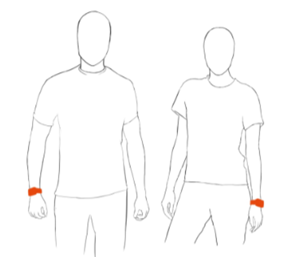
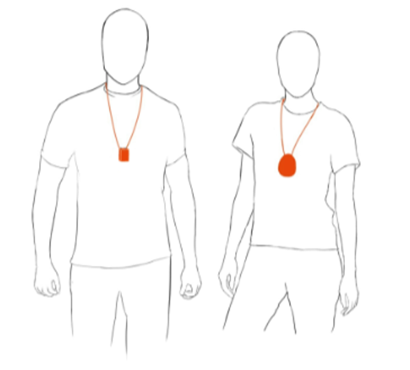
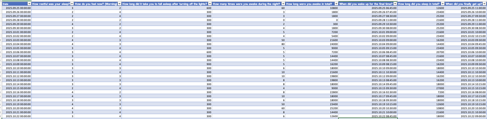
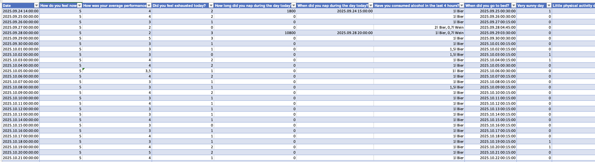

```{r}
#| echo: false
live <- "advanced_02_case_light_sensitivity-live.qmd"
static <- "advanced_02_case_light_sensitivity.qmd"
```


## Preface

A single patient reports worse sleep after bright days. Consequently, personal light exposure and activity was captured with wearable devices for several weeks. Additionally, morning and evening questionnaires were used to capture sleep, performance, and well-being self evaluations. In this tutorial, we focus on the ActLumus device worn on the chest and the self evaluations.

::: {#fig-overview layout-ncol=2}

 


:::

The tutorial focuses on

- import and merging of diary data with light data

- calculation of metrics based on sleep-wake cycles instead of calendar days

- relating exposure metrics to self assessments of consecutive sleep, performance, and wellbeing

- assessing compliance to Brown et al. (2022)[^1] recommendations

[^1]: https://doi.org/10.1371/journal.pbio.3001571



## Setup

We start by loading the necessary packages.

```{r}
#| label: setup
#| output: false
library(LightLogR) # main package
library(tidyverse) # for tidy data science
library(gt) # for great tables
library(readxl) # to read in Excel files
library(gtsummary) # for automatic summaries
```

## Import

We require both light and log data to be loaded into R before we are able to merge them.

### Light

Light data were captured with `ActLumus` devices. The exported data files sit in `data/case_light_sensitivity/`.

```{r}
#| label: context
#| fig-height: 2
#| fig-width: 6
file <- "data/case_light_sensitivity/Log_5153_20251028143545799.txt"
tz <- "Europe/Berlin"
coordinates <- c(48.775555555556, 9.1827777777778247) #Stuttgart
data <- import$ActLumus(file, tz = tz, manual.id = "ID001") #<1>
```

1. As there is only one participant, we set a manual `Id`

This dataset spans about three weeks. We know that the diaries only start on 24 September 2025 - thus we remove prior data. We also test for irregular data or gaps in this trimmed dataset.

```{r}
#| label: gap checks
data <- 
  data |> 
  filter_Date(start = "2025-09-24") |> #<1>
  ungroup() |>  #<2>
  select(Datetime, MEDI) 
data |> has_gaps()
data |> has_irregulars()
```

1. If we have a hard-set beginning or end time, `filter_Date()` or `filter_Datetime()` provide convenient cut-off functionality.

2. As we are dealing with a single participant, we don't require grouping by `Id`.

We can continue seeing as there are no issues with the regular time series. We start by plotting the full series

```{r}
#| label: first visualization
#| fig-height: 3
#| fig-width: 20
 data|> 
  aggregate_Datetime("15 minutes") |> #<1>
  gg_days(x.axis.format = "%a %d/%m") |> #<2>
  gg_photoperiod(coordinates)
```

1. Reduce the interval by averaging over 15 minute periods
2. Easily change the label format. Look at the help page of [`?strptime`](https://www.rdocumentation.org/packages/base/versions/3.6.2/topics/strptime) for the available syntax.

We can see the light intensity varies greatly. Let's look at the extremes.

```{r}
#| label: highest light exposure
#| fig-height: 5
 data|> 
  aggregate_Datetime("5 minutes") |>
  add_Date_col(group.by = TRUE) |> #<1>
  sample_groups(n=3, #<2>
                order.by = 
                  duration_above_threshold(MEDI, Datetime, threshold = 250)#<2>
                  ) |> #<2>
  ungroup(Date) |> 
  gg_doubleplot(type = "repeat") |>
  gg_photoperiod(coordinates) +
  labs(title = "Three days with highest time above 250 lx mel EDI")
```

1. Adding, and grouping by, the date gives us 20 groups, each covering one calender day
2. Select the three groups with the highest duration above 250 lx mel EDI

Looking at the first half of `02 October 2025`, we can already see that this likely a period of non-wear, or sleep - this, we have to come back to later.

```{r}
#| label: lowest light exposure
#| fig-height: 5
 data|> 
  aggregate_Datetime("5 minutes") |>
  add_Date_col(group.by = TRUE) |>
  sample_groups(n=3, 
                sample = "bottom", #<1>
                order.by = 
                  duration_above_threshold(MEDI, Datetime, threshold = 250)
                ) |> 
  ungroup(Date) |> 
  gg_doubleplot(type = "repeat") |>
  gg_photoperiod(coordinates) +
  labs(title = "Three days with lowest time above 250 lx mel EDI")
```

1. Select the three groups with the lowest duration above 250 lx mel EDI

### State data

We need information about sleep times. These can be found in the diaries.

The morning diary is all about last nights sleep, how long the needed to fall asleep, wake-ups during the night, when they got up, how rested they feel and about sleep medication. See @fig-morning for an excerpt.

::: {.column-margin}
{#fig-morning}

{#fig-evening}
:::

The evening diary is about the prior day, how well and they feel and about their performance during the day, alcohol consumation, when they got to bed, daytime naps and self-assessments about low activity and bright days. See @fig-evening for an excerpt.

In the next step we import these data and combine them to a large table. While none of these steps contain `LightLogR` functions, it is a crucial step to set the data up right for merging - particularly in that we assign the morning diaries to the prior day, and also add information about performance and fatigue on a given day to the prior day.

```{r}
#| label: Import daily diaries
state_path1 <- "data/case_light_sensitivity/evening_protocol.xlsx"
state_path2 <- "data/case_light_sensitivity/morning_protocol.xlsx"

state_evening <- read_excel(state_path1)
state_morning <- read_excel(state_path2)

state_evening$Date <- date(state_evening$Date) #<1>
state_morning$Date <- date(state_morning$Date - days(1)) #<1>
states <- left_join(state_evening, state_morning, by = "Date") #<2>

labels_states <- 
  names(states) |> 
  set_names(c("Date", "wellbeing.evening", "performance", "fatigue", 
              "daysleep.duration", "daysleep.start", "alcohol", "bedtime", 
              "sunny.day", "low.movement",
              "sleepquality", "wellbeing.morning", "sleepdelay", 
              "sleepinterruptions", "sleepinterruptions.duration", "wakeup", 
              "sleepduration", "outofbed", "medication"))
names(states) <- names(labels_states)

states <- 
  states |> mutate(performance.next = lead(performance), #<3>
                   fatigue.next = lead(fatigue)) #<3>
```

1. Store the date information of the evening diaries as is, but the morning diary will be set one day back.
2. By joining these two diaries by their (adjusted) date, morning diary information is related to the prior day evening diary.
3. We add the next days performance and fatigue level to all days.

The following table gives a short overview of the states. We will later get to whether a higher rating is better or worse for the individual items.

```{r}
states |> 
  set_names(c(labels_states, "Performance next day", "Fatigue next day")) |>  
  tbl_summary(include = where(is.numeric))
```


## Merging sleep data

Now that the diaries are prepared, we can extract sleep data from the states. The goal for the next code cell is to end with a `statechange` variable, that has a datetime for every timepoint when a new state occurs.

```{r}
#| label: create sleep data
sleep_data <-
  states |>
  mutate(sleep = bedtime + sleepdelay) |> #<1>
  select(sleep, wake = wakeup) |> #<2>
  pivot_longer(everything(), names_to = "state") |> #<3>
  add_row(state = "wake", #<4>
          value = as.POSIXct("2025-09-24 14:00:00", tz = "UTC"), #<4>
          .before = 1) #<4>
```

1. Calculate sleep timing by adding bedtime and sleepdelay
2. Reduce the dataset to only sleep and wake times
3. We transform the data from wide to long format (i.e., consecutive wake-sleep statesd)
4. We add an initial `wake` for the first day

While we are at it, we can also create states according to the *Brown et al. (2022)* recommendations, which distinguish daytime (`wake`), evening (`pre-sleep`), and nighttime (`sleep`) hours. The `LightLogR` function `sleep_int2Brown()` makes this conversion a breeze. By default, the evening phase is set to a length of `3 hours`.

```{r}
#| label: create brown states
sleep_data <-
  sleep_data |> 
  sc2interval(value, state) |> #<1>
  sleep_int2Brown(Brown.night = "sleep", #<2>
                  Brown.day = "wake", #<2>
                  Brown.evening = "pre-sleep") #<2>
```

1. Convert the `statechanges` into `intervals`, i.e. from datetimes when a state changes to intervals where a state is considered `active`.
2. Add a variable (`State.Brown` by default) containing the *Brown et al. (2022)* phases. This function automatically extends the rows to include the `pre-sleep` phase.

Next, we combine the light dataset with the sleep data.

```{r}
#| label: combine datasets
data_ext <- 
data |> 
  add_states(sleep_data, #<1>
             start.colname = Interval, #<2>
             end.colname = Interval, #<2>
             force.tz = TRUE) |> #<3>
  drop_na(state) |> #<4>
  add_photoperiod(coordinates) |> 
  Brown2reference(
                  Brown.day = "wake",
                  Brown.evening = "pre-sleep",
                  Brown.night = "sleep")

data_ext |> head()
```

1. Combine the two datasets
2. Get the start and end datetimes for each state from the `Interval` column
3. Assures that the times from the `sleep_data` dataset are matched up with the light data, even though the light data uses the `Central European Time`, whereas the sleep states use the default `UTC` time zone.
4. Remove times that don't relate to any state

## Brown et al. (2022) recommendations

Let's visualize the newly extended dataset with regards to the *Brown et al. (2022)* states.

```{r}
#| label: visualize datasets
#| fig-height: 6
#| fig-width: 12
#| message: false
color_palette <-
  c(
    wake =           "#0073C2FF",
    `pre-sleep` =    "#EFC000FF",
    sleep =          "#868686FF",
    compliant =      "#658354",
    `non-compliant` = "#CD534CFF"
  )

data_ext |>
  aggregate_Datetime("15 mins") |>
  mutate(week = week(Datetime), #<1>
         week = paste0("week: ", week), #<1>
         Reference.check = 
           case_when(Reference.check ~ "compliant",
                     !Reference.check ~ "non-compliant"),
         State.Brown = fct_expand(State.Brown, "compliant", "non-compliant") |> #<2>
                       fct_relevel("wake") #<2>
  ) |> 
  group_by(week) |> #<1>
  gg_days(geom = "ribbon", #<3>
          alpha = 0.8,
          lwd = 0.5,
          aes_col = State.Brown, #<4>
          aes_fill = State.Brown, #<4>
          group = consecutive_id(State.Brown), #<4>
          x.axis.limits = \(x) { #<5>
            Datetime_limits(x, length = ddays(6), midnight.rollover = TRUE) #<5>
            } #<5>
          ) |> 
  gg_photoperiod(alpha = 0.1) |> 
  gg_states(Reference.check, #<6>
            aes_fill = Reference.check, #<6>
            ymax = -0.1, ymin = -0.5, #<7>
            alpha = 1) + 
  labs(fill = "Brown et al.",
       caption = 
         "Brown et al. (2022) recommendations are ≥ 250 lx melanopic EDI (mel EDI) during daytime (wake) hours,\n≤ 10 lx mel EDI in the evening (pre-sleep), and ≤ 1 lx mel EDI at night (sleep)") +
  guides(color = "none") +
  scale_fill_manual(values = color_palette) +
  theme_sub_strip(background = element_blank(), #<8>
                  text.y = element_blank()) #<8>
```

1. Grouping by week so that the plot is automatically sectioned into three rows
2. The expansion of factor levels is purely so that the order in the legend is automatically kept in sensible order.
3. Setting the geom to `ribbon` enables a filled band with the lower band set at 0.
4. Coloring and filling by the Brown states will only look good, if each section is kept individually. `consecutive_id()` ensures just this.
5. Manually setting the datetime limits ensures that each row is kept at 7 days
6. We add a check whether the recommendations were fulfilled and color by it.
7. Adjusting the height of the state bands ensures readability of the plot despite other color aspects.
8. As the week grouping is just for row-setting, we are not interested in the strip and thus remove it.

We can further summarize the compliance to the recommendations in a table.

```{r}
data_ext |> 
  group_by(State.Brown) |> 
  summarize(`Relative compliance` = sum(Reference.check)/n(),
            `Relative duration` = n()) |> 
  mutate(`Relative duration` = `Relative duration` / sum(`Relative duration`),
         State.Brown = fct_relevel(State.Brown, "wake")
  ) |> 
  arrange(State.Brown) |> 
  gt() |> 
  fmt_percent(decimals = 0)
```

## Calculate metrics

In this section, we calculate some light metrics that we can correlate with sleep quality. We calculate these metrics not by the 24-hour day, but rather by wake-sleep rhythms.

### Sleep-wake cycles

```{r}
data_sw <-
data_ext |> 
  add_Date_col() |> 
  number_states(state, use.original.state = FALSE) |> #<1>
  mutate(
    sleep.wake = sprintf("cycle %02.f", state.count) |> factor(), #<2>
    .before = 1) |> 
  group_by(sleep.wake)

data_sw |> head()
```

1. Create a consecutive numbering per sleep-wake cycle. Beware if states are missing in other analyses!
2. Format the sleep-wake cycles nicely

Let's look at the sleep times as a doubleplot.

```{r}
data_sw |> 
  ungroup() |>
  gg_heatmap(state == "sleep", #<1>
             doubleplot = "next", #<2>
             fill.remove = TRUE) + #<3>
  scale_fill_manual(values = c("TRUE" = "black", "FALSE" = "#00000000")) + #<3>
  guides(fill = "none") +
  labs(title = "        Doubleplot of sleep times") +
  theme(
  strip.background = element_blank(),
  strip.text.y = element_blank(),
  strip.placement = "inside")
```

1. Create a logical as the main variable that is `TRUE` when the state is `sleep`
2. Showing the next day in the doubleplot
3. Remove the default fill settings to provide your own

Again, we can look at the data as a table.

```{r}
data_sw |> durations() |> ungroup() |> gt()
```

Based on these results, we will remove `cycle 01` and `cycle 20`, as they have only partial data.

```{r}
data_sw <-
  data_sw |> filter(!sleep.wake %in% c("cycle 01", "cycle 20"))
```

### Light exposure metrics

For the last step, we will calculate two relevant light exposure metrics, `time above 250 lx mel EDI` and `dose`. and add this information to the original `states`.

```{r}
summaries_sw <- 
data_sw |> 
  summarize(
    Date = min(Date), #<1>
    dose(MEDI, Datetime, as.df = TRUE),
    duration_above_threshold(MEDI, Datetime, threshold = 250, as.df = TRUE)
  ) |> 
  left_join(states, by = "Date") #<1>
```

1. This step relates the sleep cycles to the date where the wake-state starts.
2. Adding the self-assessments to our summaries. The data (4) provides the right assignment.


We bring this information together into a comprehensive table. Variables that have no meaningful variance are removed.

```{r}
summaries_sw |> 
  select(Date, sleep.wake, dose, duration_above_250,
         wellbeing.morning, sunny.day, low.movement, performance, 
         fatigue, bedtime, sleepquality, sleepduration, 
         sleepinterruptions, sleepinterruptions.duration) |> 
  gt() |> 
  fmt_number(dose, decimals = 0) |>
  fmt_duration(c(duration_above_250, sleepduration, sleepinterruptions.duration), 
               input_units = "seconds") |> 
  fmt_time(bedtime) |> 
  fmt(c(sunny.day, low.movement), fns = \(x) ifelse(x, "Yes", "No")) |> 
  tab_header("Overview of daily light exposure metrics and key questionnaire data") |> 
  tab_spanner("Light exposure", columns = c(dose, duration_above_250)) |> 
  tab_spanner("Self-report", columns = wellbeing.morning:fatigue) |> 
  tab_spanner("Self-reported sleep", columns = bedtime:sleepinterruptions.duration) |> 
  cols_label(sleep.wake = "Sleep-wake",
             dose = "Dose mel EDI (lx·h)",
             duration_above_250 = "Time above 250lx mel EDI",
             wellbeing.morning = "Wellbeing next morning",
             sunny.day = "Sunny day",
             low.movement = "Low activity",
             performance = "Performance",
             fatigue = "Fatigue",
             bedtime = "Bedtime",
             sleepquality = "Sleep quality",
             sleepduration = "Sleep duration",
             sleepinterruptions = "Sleep interruptions",
             sleepinterruptions.duration = "Interruption duration"
             ) |> 
  tab_footnote("Higher is worse", locations = cells_column_labels(c(8, 9, 11, 13, 14))) |> 
  sub_missing()
```

## Correlations

To visualize simple correlations between the self-assessments and the light exposure metrics we create a helper function:

```{r}
time2hour <- function(x) x/3600
correlation_plot <- function(variable, label) {
  summaries_sw |> 
  #prepare the light exposure variables and bedtime variable:
  mutate(
    bedtime = hms::as_hms(bedtime) |> as.numeric() |> time2hour(),
    duration_above_250 = as.numeric(duration_above_250),
    duration_above_250 = 
      (duration_above_250 - min(duration_above_250))/
      (max(duration_above_250)-min(duration_above_250))*max(dose)/1000,
    dose = dose/1000
         ) |> 
  #create the ggplot:
  ggplot(aes(y = {{ variable }})) +
  geom_smooth(method = "lm", 
              aes(x = dose), 
              col = "#2E6F40", 
              fill = "#2E6F40") +
  geom_smooth(method = "lm", 
              aes(x = duration_above_250), 
              col = "#990011", 
              fill = "#990011") +
  geom_point(aes(x = dose), 
             col = "#2E6F40") +
  geom_point(aes(x = duration_above_250), 
             col = "#990011", size = 1) +
  scale_x_continuous(
    "Melanopic EDI dose (klx·h)",
    sec.axis = sec_axis(~ (.*1000/70280*23400 - 5580)/3600, 
                        name = "Time above 250 lx (h)")
  ) +
  cowplot::theme_cowplot() +
  theme_sub_axis_bottom(title = element_text(color = "#2E6F40"),
                        text = element_text(color = "#2E6F40")) +
  theme_sub_axis_top(title = element_text(color = "#990011"),
                        text = element_text(color = "#990011")) +
  labs(y = label) 
}
```

This allows us to easily look at the various parameters

```{r}
#| message: false
#| label: correlations
correlation_plot(wellbeing.morning, 
                 "Wellbeing on the next\nmorning (higher = better)")
correlation_plot(sleepquality, "Sleep quality\n(higher = worse")
```

Try these for yourself. Could there be a meaningful relationship?

```{r}
#| eval: false
correlation_plot(performance, "Performance during\nthe day (higher = worse)")
correlation_plot(performance.next, 
                 "Performance on the\n next day (higher = worse)")
correlation_plot(sleepduration/3600, "Sleep duration (h)")
correlation_plot(fatigue, "Fatigue during the day\n(higher = worse)")
correlation_plot(fatigue.next, "Fatigue on the next day\n(higher = worse)")
correlation_plot(sleepinterruptions, "Sleep interruptions")
correlation_plot(sunny.day, "Self-assessed sunny day")
correlation_plot(low.movement, "Self-assessed low activity")
```


