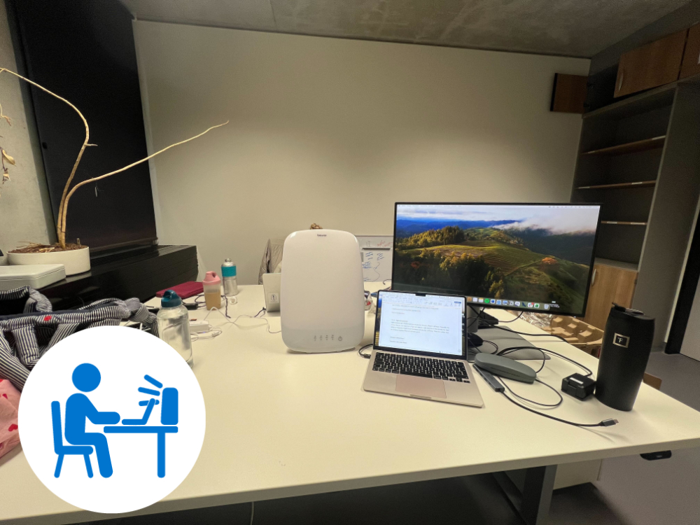
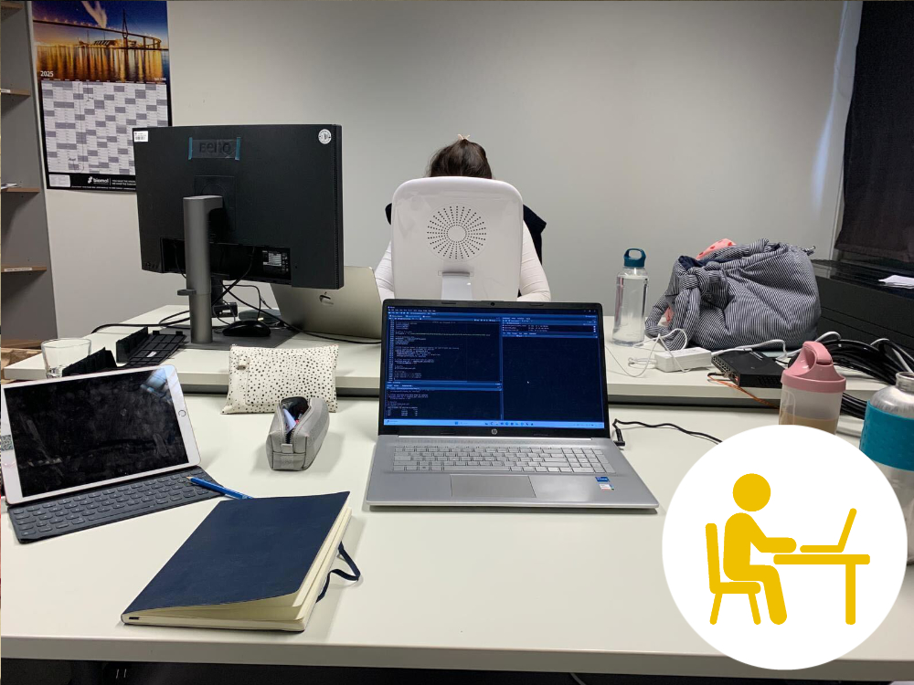
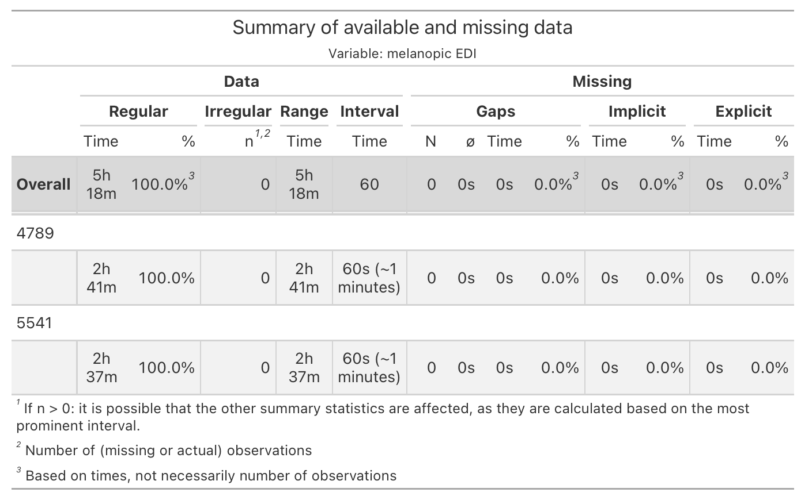
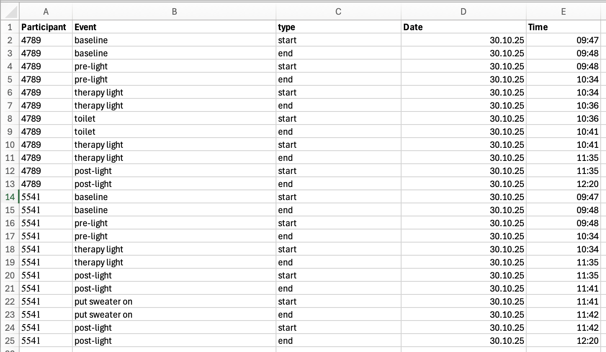



## Preface

This use case covers an exploratory protocol to capture the effect of a light therapy intervention on personal light exposure. Two participants sit in an office environment, one with, one without a therapy lamp on their respective desk. They follow a typical office workflow. The blinds are shut to reduce the directional (and thus differential) effect of daylight on participant's light exposure. Artificial lighting is switched on. In the intervention condition the therapy lamp is switched on for one hour. The participants document the start and end times of each protocol phase (pre-light, therapy light, post-light), as well as any deviations from the protocol. 

::: {#fig-overview layout-ncol=2}

 



Photographs of workplaces (pre-light). Both workplace have the same CCT roomlighting. The different appearance is due to camera whitebalance.
:::

The tutorial focuses on

- merging of participant protocol logs with light from a wearable device

- analysis of light exposure dependent on lighting conditions

- dealing with interruptions from the protocol

- advanced plotting & table styling

- working with data < 1 day in `LightLogR`





## Setup

We start by loading the necessary packages.

```{webr}
#| label: setup
#| eval: false
library(LightLogR) # main package
library(tidyverse) # for tidy data science
library(gt) # for great tables
library(legendry) # for advanced legend manipulation
library(readxl) # to read in Excel files
library(ggridges) # for stacked plots within a panel
library(ggimage) # to add images to plots
```

```{webr}
#| edit: false
# set a global theme for the background
theme_set(
    theme(
      panel.background = element_rect(fill = "white", color = NA)
    )
)
```

## Import

We require both light and log data to be loaded into R before we are able to merge them.

### Light

Light data were captured with `ActLumus` devices. The exported data files sit in `data/light_therapy/`.

```{webr}
#| label: import light
#| fig-width: 5
#| fig-height: 2
path <- "data/light_therapy"
files <- list.files(path, pattern = ".txt$", full.names = TRUE)
pattern <- "Log_(.{4})_" #<3>
tz <- "Europe/Berlin"
data <- import$ActLumus(files, tz = tz, auto.id = pattern)
```

3. Pattern to extract Id's from file names

We can see that it is a small dataset. If we visualize it we can see both participants measured simultaneously in the morning.

```{webr}
#| label: viz light
#| fig-width: 8
#| fig-height: 4
coordinates <- c(48.1371, 11.5754) #data were captured in Munich, Germany
data |> 
  gg_day(aes_col = fct_rev(Id)) |> 
  gg_photoperiod(coordinates)
```

Participant `5541` received the `therapy light`, and `4789` is the `control condition`.

While the import summary did not show indications of gaps or irregular data, it always pays to check this.

```{webr}
#| label: check light
#| eval: false
data |> 
  gap_table(full.days = FALSE) |> #<2>
  cols_hide(contains("_n")) #<3>
```

2. As we have less than one day of data, it would not be sensible to check for missing data with regards to a full day.

3. Hides a few columns which are unnecessary here



### Logs

Participant logs are stored in a consolidated Excel file. @fig-log shows the contents of the files when opened in Excel. 

::: {.callout-note}
#### On pre-cleaning of manually entered content (logs/diaries)

Note that pre-cleaning was performed to ensure consistent naming and formatting. I have yet to come upon an experiment with manually entered content in the form of logs or diaries that required no cleaning whatsoever. 

The utility of these data depend heavily on these factors, some of which can be changed after import:

- Identical naming of grouping variables between wearable devices and logs. If there are even slight differences, like an additional whitespace " ", the merge will be lossy.

- Date, time, and datetime formats must be absolutely consistent and follow a standard formatting convention. If there are differences, they will be read in as text and parsing whole columns to the desired format can be lossy.
:::

{#fig-log}

```{webr}
#| label: import logs
path <- "data/light_therapy/event_log_LightLamp.xlsx"
state_data <- read_excel(path)
state_data |> group_by(Participant) |>  slice_head(n=2)
```

Next we need to make adjustments to naming and types of variables. Note that the time variable is already recognized as a datetime, but with a nonsensical date.

```{webr}
#| label: prepare logs
state_data <-
  state_data |> 
    rename(Id = Participant, state = Event) |> #<3>
    mutate(Datetime = `date<-`(Time, Date), #<4>
           Id = factor(Id)) |> #<5>
    select(-Date, -Time) |> #<6>
    number_states(type, use.original.state = FALSE) |> #<7>
    pivot_wider(id_cols = c(Id, state, type.count), values_from = Datetime, #<8>
                names_from = type) |> #<9>
    select(-type.count) |> 
  group_by(Id)
state_data |> head()
```

3. Use naming conventions from `LightLogR`

4-6. Create a datetime that takes the `Time` variable (which is already recognized as a datetime) and just replace the `Date` component. `Id` is changed to a factor, and unnecessary columns are dropped

7. Number the `type` column by increasing the number with each `start` and `end` combo.

8-9. Pivot the dataset so that we end up with a `start` and `end` datetime for each state.

Let's get an overview of our states before merging.

```{webr}
#| label: gt logs
state_data |> 
  gt(rowname_col = "state") |> 
  tab_footnote(
    ("Note that only ID 5541 received the therapy light intervention, 
     but the time span it was active in the room is denoted in both 
     state datasets"), 
    locations = cells_stub(contains("therapy light"))
    )
```

## Combine light and log data

Combining wearable data with state data is very easy, once both datasets have been properly prepared. We are not interested in all states. States that are not part of the protocol are counted as interruptions and will not be used to calculate target metrics. These are the states we want to keep:

- Pre- and post light intervention: `pre-light`, `post-light`
- Condition during light intervention: `therapy light`
- A baseline measurement of horizontal illuminance at desk level: `baseline`

```{webr}
#| label: combine data
#| autorun: true
states_to_keep <- c("pre-light", "therapy light", "post-light", "baseline")
print("already executed")
```

In the next step, we add the information to our light dataset and perform some reformatting of the state names.

```{webr}
data <-
  data |> 
  select(Id, Datetime, MEDI) |> 
  add_states(state_data, force.tz = TRUE) |> #<3>
  mutate(state = state |> 
                  factor(levels = states_to_keep, #<5>
                         labels = states_to_keep |> str_to_sentence()) |> #<6>
                  fct_recode(`Desk (horizontal)` = "Baseline") #<7>
  )
data |> slice_head(n=3)
```

3. Merges the `state_data` participant logs with the wearable `data`. `force.tz = TRUE` assures that the times from the states dataset are matched up with the light data, even though the light data uses the `Central European Time`, whereas the states use the default `UTC` time zone.

5-7. Here we perform several actions on the resulting state. First, we create a factor that only has the relevant states (and will be `NA` otherwise), and relabel them for sentence case. Lastly we recode the baseline to the correct label.

## Compare conditions

### Histogram

This next section is not using any `LightLogR` functions, but it helps to get a sense for the data.

```{webr}
#| label: histogram
#| fig-width: 8
#| fig-height: 5

data |> 
  filter(state %in% c("Post-light", "Pre-light", "Therapy light")) |> 
  ggplot(aes(x=MEDI, y = state, fill = fct_rev(Id))) +
  geom_density_ridges(aes(height = after_stat(ncount)), 
                      stat = "binline",
                      binwidth = 100, 
                      col = NA,
                      alpha = 0.75,
                      scale = 0.75,
                      draw_baseline = TRUE) +
  theme_ridges() +
  ggsci::scale_fill_jco() +
  scale_x_continuous(breaks = c(0, seq(500, 2500, by = 500))) +
  coord_cartesian(ylim = c(1, NA), expand = FALSE) +
  labs(y = NULL, x = "melanopic EDI (lx)", fill = "Participant") +
  theme(panel.grid.major.y = ggplot2::element_line("grey95"), 
    panel.grid.major.x = ggplot2::element_line(colour = "grey", 
      linewidth = 0.25))

```

### Table

This section serves to create a fully code-based tabular overview of the data. First, we need to collect the data in the necessary format. Here, one important question arises. Because of the interruptions, no participant has a singular period for all three conditions (pre, light, post). Depending on the `LightLogR` functions we use, we can either calculate key metrics for all times a certain state is active (`by state`), or by each episode a certain state is active (`by episode`). In our case, the `by state` approach is the better one, but we will highlight both workflows here:

::: {.panel-tabset}

#### by episode

```{webr}
#| label: table preparation by episode
data |>
  extract_states(state) |> #<2>
  extract_metric(data, #<3>
                 mean = mean(MEDI), #<4>
                 dose = dose(MEDI, Datetime, epoch = "60s", na.rm = TRUE )) |>  #<5>
  summarize_numeric() |> #<6>
  select(Id, state, episodes, mean_mean, mean_dose, total_duration) |> 
  drop_na() 
```

2. Condense the dataset to an account of each episode of state (given the grouping by participant). While this is very close to our original `state_data` it takes the wearable data into account as well.

3-5. We extract specific metrics from the original dataset with regards to the extracted data. In this case the arithmetic mean (as logarithmic distribution is not really an issue here), and the dose of light.

6. This function not only calculates the average of values within each group (participant and state in this case), but also provide the total duration for each condition.

Have a special look at the `dose`. Participant `4789` has an average illuminance of ~250 lx during `Therapy light`, which lasted for a total of 56 minutes. But the dose only shows ~ 125 lx·h. The reason for that is, because it is not `dose`, but the `mean_dose` across all episodes, of which there are two (due to the interruption). We could correct that bei either scaling the dose by episode post-hoc, or by using a manual summary function that takes the duration of individual episodes into account. Instead, we have a different way of getting to the correct outcome by using the `durations()` function instead of `extract_states()`.

#### by state

```{webr}
#| label: table preparation by state
data_prep <- #<1>
data |>
  drop_na(state) |> 
  group_by(state, .add = TRUE)

data_prep |> 
  durations(MEDI) |> #<7>
  extract_metric(data_prep, #<8>
                 identifying.colname = state, #<9>
                 mean = mean(MEDI), 
                 dose = dose(MEDI, Datetime, epoch = "60s", na.rm = TRUE )) |>
  select(Id, state, mean, dose, total_duration = duration)
```

1. We require a dataset that is also grouped by the state variable

7. Calculate the duration of every state - but only when a value for melanopic EDI is available 

8. The function requires the same dataset that was the basis for `durations()`

9. It further requires an identifying column name for the extraction. In our case, the `state` column is sufficient

Again, have a look at the `dose`. Participant `4789` has an average illuminance of ~267 lx during `Therapy light`, which lasted for a total of 56 minutes. The dose is 249 lx·h, which is exactly what you would get by dividing 267lx by 60 minutes times 56 minutes.

:::

Thus we will continue with the `by state` method and prepare the data for the table.

```{webr}
data_tbl_comparison <- 
data_prep |> 
  durations(MEDI) |> 
  extract_metric(data_prep, 
                 identifying.colname = state, 
                 mean = mean(MEDI), 
                 dose = dose(MEDI, Datetime, epoch = "60s", na.rm = TRUE )) |>
  select(Id, state, mean, dose, total_duration = duration) |> 
  mutate(Id = case_when(  
                        Id == "4789" ~ "Control condition", 
                        Id == "5541" ~ "Therapy light"), 
         across(contains("total_duration"), \(x) replace_na(x, dminutes(1))) #<12>
         ) |>
  pivot_wider(id_cols = state, #<14>
              names_from = Id, #<15>
              values_from = c(mean, total_duration, dose)) |> #<16>
  arrange(state) |> 
  select(1, 2, 4, 6, 3, 5, 7)
data_tbl_comparison
```

12. If there is only a singular datapoint, `durations()` can not discern its *validity* duration. Here we manually exchange it for the epoch.

14-16. By pivoting wider we move from one row per condition and participant to one row per condition.

Then we can produce the table. This next code cells does not contain any `LightLogR` functions, but simply uses our previous output (`data_tbl_comparison`) and prints it as a `gt` table.

```{webr}
#| label: table
data_tbl_comparison |> 
  gt(rowname_col = "state", groupname_col = NULL) |> 
  tab_spanner("Control condition", contains("Control condition")) |> 
  tab_spanner("Therapy lamp", contains("Therapy light", ignore.case = FALSE)) |> 
  cols_label_with(
    fn = \(x) x |> 
               str_remove_all(" |_|Control|condition|Therapy|total|light|No") |> 
               str_to_title()
    ) |> 
  tab_style(locations = cells_column_spanners(1),
            style = cell_text(color = "#EFC000", weight = "bold")
  ) |> 
  tab_style(locations = cells_column_spanners(2),
            style = cell_text(color = "#0073C2", weight = "bold")
  ) |> 
  cols_align("left", columns = state) |> 
  cols_add(
    `Rel. difference` = 
    (`dose_Therapy light`-`dose_Control condition`)/`dose_Control condition`) |> 
  fmt(columns = contains("mean"), 
      fns =  \(x) vec_fmt_number(x, decimals = 0, pattern = "{x} lx")
      ) |> 
  fmt(columns = contains("dose"), 
      fns =  \(x) vec_fmt_number(x, decimals = 0, pattern = "{x} lx·h")
      ) |> 
  fmt_percent(contains("difference"), force_sign = TRUE, decimals = 0) |> 
  gt::cols_width(-state ~ px(100), 
                 state ~ px(150)) |> 
  grand_summary_rows(
    columns = contains("dose"),
    fns = list(label = "Overall", id = "overall", fn = "sum"),
    fmt = contains("dose")~ fmt_number(., decimals = 0, pattern = "{x} lx·h")
  ) |> 
  grand_summary_rows(
    columns = contains("duration"),
    fns = list(label = "Overall", id = "overall", fn = "sum"),
    missing_text = "",
    fmt = ~ fmt_duration(., input_units = "seconds", output_units = "minutes",
                         duration_style = "wide"),
  ) |> 
  gt::grand_summary_rows(
    fns = list(label = "Overall", id = "totals") ~ 
      (sum(`dose_Therapy light`)/sum(`dose_Control condition`)-1),
    fmt = ~ gt::fmt_percent(., decimals = 0, force_sign = TRUE),
    columns = dplyr::contains("difference"),
    missing_text = ""
    ) |> 
  fmt_duration(contains("duration"), 
               input_units = "seconds", 
               output_units = "minutes",
               duration_style = "wide") |> 
  tab_style(locations = list(cells_stub(), 
                             cells_column_labels(),
                             cells_stub_grand_summary()),
            style = cell_text(weight = "bold"))
```

### Plot

In this section we create two plots of our data, highlighting the differences due to the intervention. The first plot contains a timeline of melanopic EDI, the second the cumulative dose. 

We start with a few necessary preparations:

```{webr}
#| label: preparations
# times set the experimental states
times <- c(9 +48/60, 10 + 34/60, 11 + 35/60, 12 + 20/60)*60*60

# define a protocol axis for plotting
protocol_bracket <- primitive_bracket(
  # Keys determine what is displayed
  key = key_range_manual(start = times[1:3], end = times[2:4], level = 1,
                         name = c("Pre-light", "Therapy light", "Post-light")),
  bracket = "square",
  theme = theme(legend.text = element_text(face = "bold"))
)

#paths to symbols
path_lamp <- "assets/advanced/5541.png"
path_default <- "assets/advanced/4789.png"

#get relevant data for plotting the symbols
symbols <- 
data |> 
  drop_na(state) |> 
  summarize(
    dose(MEDI, Datetime, na.rm = TRUE, as.df = TRUE),
    total_duration = n()*60
  ) |> 
  tibble(
    image = c(path_default, path_lamp),
    y = c(600, 2500),
    x = c(11.125*60*60)
  )
symbols
```

Now we are ready to create the first plot:

```{webr}
#| label: medi plot
#| message: false
#| warning: false
data |> 
  drop_na(state) |> #<2>
  filter(state != "Desk (horizontal)") |> #<3>
  gap_handler() |> #<4>
  gg_day(aes_col = fct_rev(Id), #<5>
         geom = "line", #<6>
         facetting = FALSE, #<7>
         y.scale = "identity", #<8>
         x.axis.breaks = hms::hms(hours = seq(0, 24, by = 0.5)), #<9>
         y.axis.breaks = c(0, 250,seq(500, 2500, by = 500))) |> #<10>
  gg_states(state, #<11>
            aes_fill = state, #<12>
            alpha = 0.05, #<13> 
            ) + #<14>
  scale_fill_manual(values = c(`Therapy light` = "#0073C2FF")) + #<15>
  guides(fill = "none", color = "none", 
         x = guide_axis_stack(protocol_bracket, "axis")) + #<17>
  coord_cartesian(xlim = c(9.5, 12.6)*60*60, #<18>
                  ylim = c(0, 2850), 
                  expand = FALSE) +
  geom_image(data = symbols, inherit.aes = FALSE, #<21>
             aes(image = image, x = x, y = y), size = 0.2, alpha = 1) +
  labs(caption = 
         "Note: interruptions from the protocol (e.g. restroom usage) were removed."
       )
```

2-3. Remove all the states that do not belong the experimental protocol

4. Fill in empty observations for the filtered times

5. `LightLogR` plotting function - we use the reverse coding of participants to get the desired coloring

6. By default `gg_day()` plots points, this changes it to lines

7. By default, `gg_day()` creates one panel per day. In this case, we are not interested in identifying the day.

8. By default, `gg_day()` scales with `symlog` to include 0 with logarithmic scaling. `"identity"` simply sets it to a linear scale.

9. By default, `gg_day()` creates breaks every three hours, here we set it to every half hour.

10. By default, `gg_day()` sets breaks every 10^ step. Here we set it to steps of 500 lx, but also keeping 250 lx, as that is the base intensity.

11-14. `gg_states()` adds the backdrop of states. Try setting `ymin` and `ymax`.

15. Ensures that the `Therapy light` condition has a blue coloring

17. Adds the axis we prepared before

18. Reduce the limits of the plots to areas of interest

21. Adding the symbols

Lastly, we create a cumulative plot. Only the differences compared to above will be highlighted here.

```{webr}
#| label: cumulative plot
#| message: false
#| warning: false
data |> 
  drop_na(state) |>
  filter(state != "Desk (horizontal)") |> 
  mutate(
    dose = cumsum(MEDI)/60 #<1>
  ) |> 
  gap_handler() |>
  gg_day(aes_col = fct_rev(Id), geom = "line", facetting = FALSE,
         y.axis = dose, #<2>
         y.scale = "identity",
         x.axis.breaks = hms::hms(hours = seq(0, 24, by = 0.5)),
         y.axis.breaks = c(seq(0, 2500, by = 500))
         ) |> 
  gg_states(state, aes_fill = state, alpha = 0.05) +
  scale_fill_manual(values = c(`Therapy light` = "#0073C2FF")) +
  guides(fill = "none", color = "none", 
         x = guide_axis_stack(protocol_bracket, "axis")) +
  coord_cartesian(xlim = c(9.5, 12.6)*60*60, 
                  ylim = c(0, 2850),
                  expand = FALSE,
                  clip = FALSE
                  ) +
  geom_image(data = symbols, inherit.aes = FALSE,
             aes(image = image,
                 x = 12.48*60*60,
                 y = dose),
             size = 0.15
             ) +
  labs(
    caption = 
      "Note: interruptions from the protocol (e.g. restroom usage) were removed."
    )
```

1. We calculate a cumulative value from start to end for each participant

2. We set the y.axis variable to `dose` instead of the default `MEDI`


