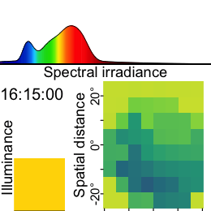
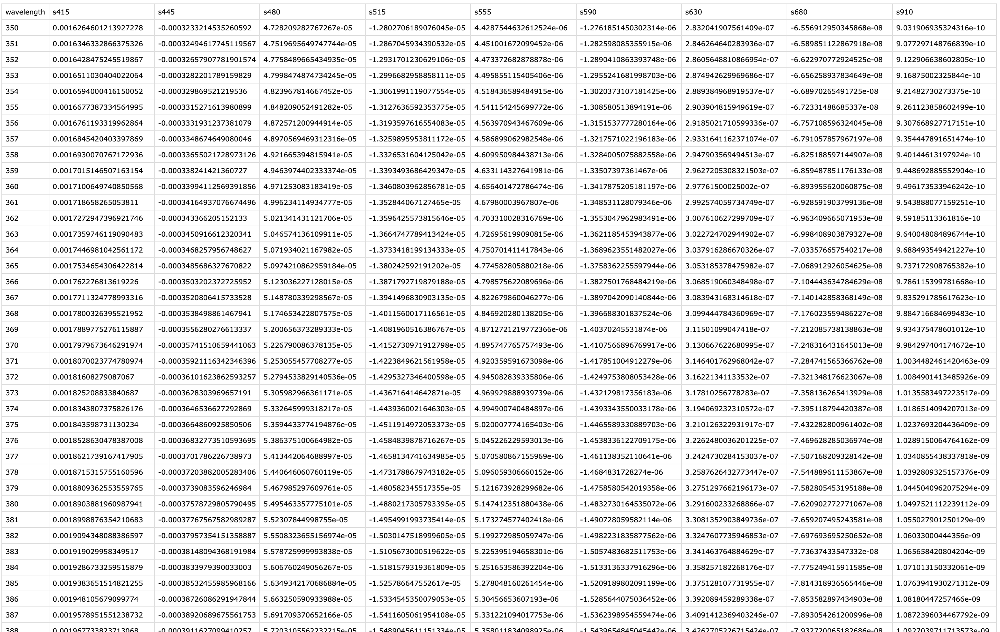

```{r}
#| echo: false
live <- "advanced_04_visual_experience-live.qmd"
static <- "advanced_04_visual_experience.qmd"
```

## Preface

Wearable devices can capture more besides illuminance or melanopic EDI. They can capture many aspects of the visual environment that, from an observer's perspective, form the visual experience. In this use case we focus on a multimodal dataset, captured by the `VEET` device [^1]. It simultaneously captures from different sensors to collect **light** (ambient light sensor `ALS`), **viewing distance** (time of flight `TOF`), **spectral information** (spectral light channels, `PHO`), and **motion and orientation** (inertial measurements `IMU`). The data we are looking at do not come from a specific experiment, but are pilot data captured by an individual participant. The example is adapted from the online tutorial by [Zauner et al. (2025)](https://tscnlab.github.io/ZaunerEtAl_JVis_2025/){target="_blank"}.

[^1]: https://projectveet.com

{width="50%" height="50%"}

The tutorial focuses on

-   import multimodal data

-   reconstruction of a spectral power distribution from sensor data

-   calculating spectrum-based metrics

-   simplifying a spatial grid of distance measurements

-   detecting clusters of conditions (for distance)



## Setup

We start by loading the necessary packages.

```{r}
#| label: setup
#| output: false
library(LightLogR) # main package
library(tidyverse) # for tidy data science
library(gt) # for great tables
library(ggridges) # for stacked plots within a panel
library(slider) # for sliding windows
```

## Spectrum

### Import

The **VEET** device records multiple data modalities in one combined file. Its raw data file contains interleaved records for different sensor types, distinguished by a “modality” field. Here we focus first on the spectral sensor modality (**PHO**) for spectral irradiance data, and below under @sec-importdistance the time-of-flight modality (**TOF**) for distance data.

In the `VEET`’s export file, each line includes a timestamp and a modality code, followed by fields specific to that modality. Importantly, this means that the `VEET` export is not rectangular, i.e., tabular. The non-rectangular structure of the `VEET` files can be seen in @fig-veet to the side. This makes it challenging for many import functions that expect the equal number of columns in every row, which is not the case in this instance. For the **PHO (spectral) modality**, the columns include a timestamp, integration time, a general `Gain` factor, and nine sensor channel readings covering different wavelengths (with names like `s415, s445, ..., s680, s940`) as well as a `Dark` channel and a broadband channels `Clear`. In essence, the `VEET`’s spectral sensor captures light in several wavelength bands (from \~415 nm up to 940 nm, plus an infrared and “clear” channel) rather than outputting a single lux value like the ambient light sensor does (*PHO*). Unlike illuminance, the spectral data are not directly given as directly interpretable radiometric metrics but rather as raw sensor counts across multiple wavelength channels, which require conversion to reconstruct a spectral power distribution. In our analysis, spectral data allow us to compute metrics like the relative contribution of short-wavelength (blue) light versus long-wavelength light in the participant’s environment. Processing this spectral data involves several necessary steps.

::: column-margin
{#fig-veet}
:::

To import the `VEET` ambient light data, we use the LightLogR import function, specifying the `PHO` modality. The raw VEET data in our example is provided as a zip file (`02_VEET_L.csv.zip`) containing the logged data for about four days. We do the following:

```{r}
#| label: fig-VEET-spectrum-overview
#| fig-cap: "Overview plot of imported VEET spectral data"
#| fig-height: 2
#| fig-width: 6
# Import VEET Spectral Sensor (PHO) data
tz   <- "US/Central"    # assuming device clock was set to US Central
path <- "data/visual_experience/02_VEET_L.csv.zip"
data <- import$VEET(path, 
                    tz = tz, 
                    modality = "PHO", #<1>
                    manual.id = "VEET", #<2>
                    version = "2.1.7" #<3>
                    )
```

1.  `modality` is a parameter only the `VEET` device requires. If uncertain, which devices require special parameters, have a look a the import help page (`?import`) under the `VEET` device. Setting it to `PHO` gives us the spectral modality.
2.  As we are only dealing with one individual here, we set a manual `Id`
3.  In `LightLogR 0.10.0 High noon`, which is the current version as this use case was written, this argument would not be necessary, as it is the default version. Things might change, however in the future. Setting this version argument ensures that the file will be read in correctly, even if the default file format evolves over time.

```{r}
#| fig-width: 8
#| fig-height: 4
data |> gg_days(s480, y.axis.label = "s480 (raw counts)")
```

To check which `version` is available for a device (and what the default version is that is called when nothing is provided), check the following function.

```{r}
supported_versions("VEET") |> gt()
```

After import, `data` contains columns for the timestamp (`Datetime`), `Gain` (the sensor gain setting), and the nine spectral sensor channels plus a clear channel. These appear as numeric columns named `s415, s445, ..., s940, Dark, Clear`. Other columns are also present but not needed for now. The spectral sensor was logging at a 2-second rate. It is informative to look at a snippet of the imported spectral data before further processing. @tbl-PHO shows three rows of `data` after import (before calibration), with some technical columns omitted for brevity:

```{r}
#| label: tbl-PHO
#| tbl-cap: "Overview of the spectral sensor import from the VEET device (3 observations). Each row corresponds to a 2-second timestamp (Datetime) and shows the raw sensor readings for the spectral channels (s415–s940, Dark, Clear). All values are in arbitrary sensor units (counts). Gain values and integration_time are also relevant for each interval, depending on the downstream computation."
data |> 
  slice(6000:6003) |> 
  select(-c(modality, file.name, time_stamp)) |> 
  gt() |> 
  fmt_number(s415:Clear) 
```

### Spectral calibration

Now we proceed with **spectral calibration**. The `VEET`’s spectral sensor counts need to be converted to physical units (spectral irradiance) via a calibration matrix provided by the manufacturer. For this example, we assume we have a calibration matrix that maps all the channel readings to an estimated spectral power distribution (SPD). The LightLogR package provides a function `spectral_reconstruction()` to perform this conversion. However, before applying it, we must ensure the sensor counts are in a normalized form. This procedure is laid out by the manufacturer. In our version, we refer to the [*VEET SPD Reconstruction Guide.pdf*](https://projectveet.com/wp-content/uploads/VEET-Spectral-Power-Distribution-Reconstruction-Guide.pdf){target="_blank"}, version *06/05/2025*. Note that each manufacturer has to specify the method of count normalization (if any) and spectral reconstruction. In our raw data, each observation comes with a `Gain` setting that indicates how the sensor’s sensitivity was adjusted; we need to divide the raw counts by the gain to get normalized counts. LightLogR offers `normalize_counts()` for this purpose. We further need to scale by integration time (in milliseconds) and adjust depending on counts in the `Dark` sensor channel.

```{r}
count.columns <- c("s415", "s445", "s480", "s515", "s555", "s590", "s630", #<1>
                      "s680", "s910", "Dark", "Clear") #<1>

gain.ratios <- #<2>
  tibble( #<2>
    gain = c(0.5, 1, 2, 4, 8, 16, 32, 64, 128, 256, 512), #<2>
    gain.ratio = #<2>
      c(0.008, 0.016, 0.032, 0.065, 0.125, 0.25, 0.5, 1, 2, 3.95, 7.75) #<2>
  ) #<2>

#normalize data:
data <-
  data |> 
  mutate(across(c(s415:Clear), \(x) (x - Dark)/integration_time)) |>  #<3> 
  normalize_counts( #<4>
    gain.columns = rep("Gain", 11), #<5> 
    count.columns = count.columns, #<6>
    gain.ratios #<7>
  ) |> 
  select(-c(s415:Clear)) |> #<8>
  rename_with(~ str_remove(.x, ".normalized")) #<8>
```

1.  Column names of variables that need to be normalized
2.  Gain ratios as specified by the manufacturer's reconstruction guide
3.  Remove dark counts & scale by integration time
4.  Function to normalize counts
5.  All sensor channels share the gain value
6.  Sensor channels to normalize (see 1.)
7.  Gain ratios (see 2.)
8.  Drop original raw count columns

In this call, we specified `gain.columns = rep("Gain", 11)` because we have 11 sensor columns that all use the same gain factor column (`Gain`). This step will add new columns (with a suffix, e.g. `.normalized`) for each spectral channel representing the count normalized by the gain. We then dropped the `raw` count columns and renamed the normalized ones by dropping `.normalized` from the names. After this, `data` contains the normalized sensor readings for `s415, s445, ..., s940, Dark, Clear` for each 5-minute time point.

Because we do not need this high a resolution, we will **aggregate it to a 5-minute interval** for computational efficiency. The assumption is that spectral composition does not need to be examined at every 2-second instant for our purposes, and 5-minute averages can capture the general trends while drastically reducing data size and downstream computational costs.

```{r}
# Aggregate spectral data to 5-minute intervals and mark gaps
data <- data |>
  aggregate_Datetime(unit = "5 mins") |>  # aggregate to 5-minute bins
  gap_handler(full.days = TRUE) |>        # explicit NA for any gaps in between
  add_Date_col(group.by = TRUE) |> #<1>
  remove_partial_data(Clear, threshold.missing = "-23 hour") #<2>
```

1.  Group the data by calendar day
2.  Remove days (i.e., groups) with less than 23 hours of available data. By setting the `threshold.missing` to a negative number, we enforce minimum duration, which is great when the total duration of a group is not known or varies.

We use one of the channels (here `Clear`) as the reference variable for `remove_partial_data` to drop incomplete days (the choice of channel is arbitrary as all channels share the same level of completeness). The dataset is now ready for spectral reconstruction.

::: callout-warning
Please be aware that `normalize_counts()` requires the `Gain` values according to the gain table. If we had aggregated the data before normalizing it, `Gain` values would have been averaged within each bin (5 minutes in this case). If the `Gain` did not change in that time, it is not an issue. Any mix of `Gain` values will lead to a `Gain` value that is not represented in the gain table. While outputs for `normalize_counts()` are not wrong in these cases, they will output `NA` if a `Gain` value is not found in the table. Thus we recommend to always normalize counts based on the raw dataset.
:::

### Spectral reconstruction

For spectral reconstruction, we require a calibration matrix that corresponds to the `VEET`’s sensor channels. This matrix would typically be obtained from the device manufacturer or a calibration procedure. It defines how each channel’s normalized count relates to intensity at various wavelengths. For demonstration, the calibration matrix was provided by the manufacturer and is specific to the make and model (see @fig-calibmtx). It should not be used for research purposes without confirming its accuracy with the manufacturer.

::: column-margin
{#fig-calibmtx}
:::

```{r}
#import calibration matrix
calib_mtx <- # <1>
  read_csv("data/visual_experience/VEET_calibration_matrix.csv", # <1>
           show_col_types = FALSE) |> # <1>
  column_to_rownames("wavelength") # <1>

# Reconstruct spectral power distribution (SPD) for each observation
data <- 
  data |> 
  mutate(
  Spectrum = 
    spectral_reconstruction( # <2>
      pick(s415:s910),   # <3>
      calibration_matrix = calib_mtx, #<4>
      format = "long" # <5>
  )
)
```

1. Import the calibration matrix and make certain `wavelength` is set a rownames
2.  The function `spectral_reconstruction()` does not work on the level of the dataset, but has to be called within `mutate()`(or provided the data directly)
3.  Pick the normalized sensor columns
4.  Provide the calibration matrix
5.  Return a long-form list column (wavelength, intensity)

Here, we use `format = "long"` so that the result for each observation is a **list-column** `Spectrum`, where each entry is a tibble[^2] containing two columns: `wavelength` and `irradiance` (one row per wavelength in the calibration matrix). In other words, each row of `data` now holds a full reconstructed spectrum in the `Spectrum` column. The long format is convenient for further calculations and plotting. (An alternative `format = "wide"` would add each wavelength as a separate column, but that is less practical when there are many wavelengths.)

[^2]: **tibble** are data.tables with tweaked behavior, ideal for a tidy analysis workflow. For more information, visit the documentation page for [tibbles](https://tibble.tidyverse.org/index.html){target="_blank"}

To visualize the data we will calculate the photopic illuminance based on the spectra and plot each spectrum color-scaled by their illuminance. For clarity, we reduce the data to observations within the day that has the most observations (non-`NA`).

```{r}
data_spectra <- 
data |> 
  sample_groups(order.by = sum(!is.implicit)) |> #<1>
  mutate( 
    Illuminance = Spectrum |> #<2>
      map_dbl(spectral_integration, #<3>
              action.spectrum = "photopic", #<4>
              general.weight = "auto") #<5>
  ) |> 
  unnest(Spectrum) #<6>
data_spectra |> select(Id, Date, Datetime, Illuminance) |> distinct()
```

1.  Keep only observations for one day (with the lowest missing intervals)
2.  Use the spectrum,...
3.  ... call the function `spectral_integration()` for each,...
4.  ... use the brightness sensitivity function,...
5.  ... and apply the appropriate efficacy weight.
6.  Create a long format of the data where the spectrum is unnested

The following plot visualizes the spectra:

```{r}
#| label: fig-VEET-spectra-intensity
#| fig-cap: "Overview of the reconstructed spectra, color-scaled by photopic illuminance (lx)"
#| fig-height: 5
#| fig-width: 8
data_spectra |> 
  ggplot(aes(x = wavelength,group = Datetime)) +
  geom_line(aes(y = irradiance*1000, col = Illuminance)) +
  labs(y = "Irradiance (mW/m²/nm)", 
       x = "Wavelength (nm)", 
       col = "Photopic illuminance (lx)") +
  scale_color_viridis_b(breaks = c(0, 10^(0:3))) +
  scale_y_continuous(trans = "symlog", breaks = c(0, 1, 10, 50)) +
  coord_cartesian(ylim = c(0,NA), expand = FALSE) +
  theme_minimal()
```

The following ridgeline plot can be used to assess **when** in the day certain spectral wavelenghts are dominant:

```{r}
#| label: fig-VEET-spectra-time
#| fig-cap: "Overview of the reconstructed spectra by time of day, color-scaled by photopic illuminance (lx)"
#| fig-height: 5
#| fig-width: 8
data_spectra |> 
  ggplot(aes(x = wavelength, group = Datetime)) +
  geom_ridgeline(aes(height = irradiance*1000, 
                     y = Datetime, 
                     fill = Illuminance), 
                 scale = 400, lwd = 0.1, alpha = 0.7) +
  labs(y = "Local time & Irradiance (mW/m²/nm)", 
       x = "Wavelength (nm)", 
       fill = "Photopic illuminance (lx)")+
  scale_fill_viridis_b(breaks = c(0, 10^(0:3))) +
  theme_minimal()
```

At this stage, the `data` dataset has been processed to yield time-series of spectral power distributions. We can use these to compute biologically relevant light metrics. For instance, one possible metric is the proportion of power in short wavelengths versus long wavelengths.

With the `VEET` spectral preprocessing complete, we emphasize that these steps – normalizing by gain, applying calibration, and perhaps simplifying channels – are **device-specific** requirements. They ensure that the raw sensor counts are translated into meaningful physical measures (like spectral irradiance). Researchers using other spectral devices would follow a similar procedure, adjusting for their device’s particulars (some may output spectra directly, whereas others, like `VEET`, require reconstruction.

::: callout-note
Some devices may output normalized counts instead of raw counts. For example, the `ActLumus` device outputs normalized counts, while the `VEET` device records raw counts and the gain. Manufacturers will be able to specify exact outputs for a given model and software version.
:::

### Metrics

::: callout-note
Spectrum-based metrics in wearable data are relatively new and less established compared to distance or broadband light metrics. The following examples illustrate potential uses of spectral data in a theoretical sense, which can be adapted as needed for specific research questions.
:::

#### Ratio of short- vs. long-wavelength light

Our first spectral metric is the ratio of short-wavelength light to long-wavelength light, which is relevant, for example, in assessing the blue-light content of exposure. For this example, we will arbitrarily define "short" wavelengths as 400–500 nm and "long" as 600–700 nm. Using the list-column of spectra in our dataset, we integrate each spectrum over these ranges (using [`spectral_integration()`](https://tscnlab.github.io/LightLogR/reference/spectral_integration.html){target="_blank"}), and then compute the ratio short/long for each time interval. We then summarize these ratios per day.

```{r}
data <- 
  data |> 
  select(Id, Date, Datetime, Spectrum) |>    #<1>
  mutate(
    short = #<2>
      Spectrum |> map_dbl(spectral_integration, wavelength.range = c(400, 500)),#<2>
    long  = #<3>
      Spectrum |> map_dbl(spectral_integration, wavelength.range = c(600, 700))#<3>
  )
```

1.  Focus on ID, date, time, and spectrum
2.  Integrate over the spectrum from 400 to 500 nm
3.  Integrate over the spectrum from 600 to 700 nm

@tbl-ratio shows the average short/long wavelength ratio, averaged over each day (and then as weekday/weekend means if applicable). In this dataset, the values give an indication of the spectral balance of the light the individual was exposed to (higher values mean relatively more short-wavelength content).

```{r}
#| label: tbl-ratio
#| tbl-cap: "Average (mW/m²) and ratio of short-wavelength (400–500 nm) to long-wavelength (600–700 nm) light"
data |> 
  summarize_numeric(prefix = "", remove = c("Datetime", "Spectrum")) |> 
  mutate(`sl ratio` = short / long) |> 
  gt() |> 
  fmt_number(decimals = 1, scale_by = 1000) |>
  fmt_number(`sl ratio`, decimals = 3) |>
  cols_hide(episodes)
```

#### Melanopic daylight efficacy ratio (MDER)

The same idea is behind calculating the melanopic daylight efficacy ratio (or MDER), which is defined as the melanopic EDI divided by the photopic illuminance. Results are shown in @tbl-mder. In this case, instead of a simple integration over a wavelength band, we apply an action spectrum to the spectral power distribution (SPD), integrate over the weighted SPD, and apply a correction factor. All of this is implemented in `spectral_integration()`.

```{r}
data <- 
  data |> 
  select(Id, Date, Datetime, Spectrum, short, long) |>
  mutate(
    melEDI = #<1>
      Spectrum |> map_dbl(spectral_integration, action.spectrum = "melanopic"),#<1>
    illuminance  = #<2>
      Spectrum |> map_dbl(spectral_integration, action.spectrum = "photopic")#<2>
  )
```

1.  Calculate melanopic EDI by applying the $s_{mel (\lambda)}$ action spectrum, integrating, and weighing
2.  Calculate photopic illuminance by applying the $V_{(\lambda)}$ action spectrum, integrating, and weighing

```{r}
#| label: tbl-mder
#| tbl-cap: "Average melanopic daylight efficacy ratio (MDER)"
data |> 
  summarize_numeric(prefix = "", remove = c("Datetime", "Spectrum")) |> 
  mutate(MDER = melEDI / illuminance) |>
  gt() |> 
  fmt_number(decimals = 1, scale_by = 1000) |>
  fmt_number(MDER, decimals = 3) |>
  cols_hide(episodes)
```

#### Short-wavelength light at specific times of day

The second spectral example examines short-wavelength light exposure as a function of time of day. Certain studies might be interested in, for instance, blue-light exposure during midday versus morning or night. We demonstrate three approaches: (a) filtering the data to a specific local time window, and (b) aggregating by hour of day to see a daily profile of short-wavelength exposure. Additionally, we (c) look at differences between day and night periods.

::: panel-tabset
##### Local morning exposure

@tbl-shortfilter isolates the time window between 7:00 and 11:00 each day and computes the average short-wavelength irradiance in that interval. This represents a straightforward query: “How much blue light does the subject get in the morning on average?”

```{r}
#| label: tbl-shortfilter
#| tbl-cap: "Average short-wavelength light (400–500 nm) exposure between 7:00 and 11:00 each day"
data |> 
  filter_Time(start = "7:00:00", end = "11:00:00") |> #<1>    
  select(c(Id, Date, short)) |>
  summarize_numeric(prefix = "") |> 
  gt() |> 
  fmt_number(short, scale_by = 1000) |> 
  cols_label(short = "Short-wavelength irradiance (mW/m²)") |> 
  cols_hide(episodes)
```

1.  Filter data to local 7am–11am

##### Hourly profile across the day

To visualize short-wavelength exposure over the course of a day, we aggregate the data into hourly bins. We cut the timeline into 1-hour segments (using local time), compute the mean short-wavelength irradiance in each hour for each day. @fig-shorttime shows the resulting diurnal profile, with short-wavelength exposure expressed as a fraction of the daily maximum for easier comparison.

```{r}
#| label: fig-shorttime
#| fig-cap: "Diurnal profile of short-wavelength light exposure. Each bar represents the average short-wavelength irradiance at that hour of the day (0–23 h), normalized to the daily maximum."
# Prepare hourly binned data
data_time <- data |>
  cut_Datetime(unit = "1 hour", type = "floor", group_by = TRUE) |>  # <1>
  select(c(Id, Date, short)) |>
  summarize_numeric(prefix = "") |> 
  add_Time_col(Datetime.rounded)  |>   # <2>
  mutate(rel_short = short / max(short))

#creating the plot
data_time |> 
  ggplot(aes(x=Time, y = rel_short)) +
  geom_col(aes(fill = factor(Date)), position = "dodge") +
  ggsci::scale_fill_jco() +
  theme_minimal() +
  labs(y = "Normalized short-wavelength irradiance", 
       x = "Local time (HH:MM)",
       fill = "Date") + 
  scale_y_continuous(labels = scales::label_percent()) +
  scale_x_time(labels = scales::label_time(format = "%H:%M"))
```

1.  Bin timestamps by hour
2.  Add a Time column (hour of day, based on the cut/rounded data)

##### Day vs. night (photoperiod)

Finally, we compare short-wavelength exposure during daytime vs. nighttime. Using civil dawn and dusk information (based on geographic coordinates, here set for Houston, TX, USA), we label each measurement as day or night and then compute the total short-wavelength exposure in each period. @tbl-daytime summarizes the daily short-wavelength dose received during the day vs. during the night.

```{r}
#| label: tbl-daytime
#| tbl-cap: "Short wavelength light exposure (mW/m²) during the day and at night"
coordinates <- c(29.75, -95.36) # <1>
data |>
  select(c(Id, Date, Datetime, short)) |>
  add_photoperiod(coordinates) |> # <2>
  group_by(photoperiod.state, .add = TRUE) |> # <2>
  summarize_numeric(prefix = "", 
                    remove = c("dawn", "dusk", "photoperiod", "Datetime")) |> 
  group_by(Id, photoperiod.state) |> 
  select(-episodes) |> 
  pivot_wider(names_from =photoperiod.state, values_from = short) |> 
  gt() |> 
  fmt_number(scale_by = 1000, decimals = 1) |> 
  tab_header("Average short-wavelength irradiance (mW/m²)")
```

1. Coordinates for Houston, Texas, USA
2. Adding and grouping by photoperiod
:::

## Distance

### Import {#sec-importdistance}

In this second section, the distance data of the `VEET` device will be imported, analogous to the other modality. The `TOF` modality contains information for up to two objects in a 8x8 grid of measurements, spanning a total of about 52° vertically and 41° horizontally. Because the `VEET` device can detect up to two objects in a given grid point, and there is a confidence value assigned to every measurement, each observation contains $2*2*8*8 = 256$ measurements.

```{r}
#| label: fig-VEET-overview3
#| fig-cap: "Overview plot of imported VEET data"
#| fig-height: 2
#| fig-width: 6
# Import VEET Spectral Sensor (TOF) data
path <- "data/visual_experience/01_VEET_L.csv.zip"
dataDist <- import$VEET(path, 
                        tz = tz, 
                        modality = "TOF", #<1>
                        manual.id = "VEET", #<2>
                        version = "initial") #<3>
```

1.  `modality` is a parameter only the `VEET` device requires. If uncertain, which devices require special parameters, have a look a the import help page (`?import`) under the `VEET` device. Setting it to `TOF` gives us the distance modality.
2.  As we are only dealing with one individual here, we set a manual `Id`
3.  This file was captured with an older `VEET` firmware. Thus we set `version = "initial"`, so it reads it correctly.

In a first step, we condition the data similarly to the other `VEET` modality. For computational reasons of the use cases, we remove the second object and set the interval to `10 seconds`. *Note that the next step still takes considerable computation time*.

```{r}
#| label: VEET-cleaning
# Aggregate distance data to 10-second intervals and mark gaps
dataDist <- 
  dataDist |>
  select(-contains(c("conf2_", "dist2_"))) |> # <1>
  aggregate_Datetime(unit = "10 secs") |>     # <2>
  gap_handler(full.days = TRUE) |>           # <3>
  add_Date_col(group.by = TRUE) |> 
  remove_partial_data(dist1_0, threshold.missing = "1 hour")
dataDist |> summary_overview(dist1_0)
```

1.  Remove the second object (for computational reasons)
2.  Aggregate to 10-second bins
3.  Explicit NA for any gaps

In the next step, we need to transform the `wide` format of the imported dataset into a `long` format, where each row contains exactly one observation for one grid-point.

```{r}
#| label: VEET-long
dataDist <- 
  dataDist |> 
  pivot_longer(
    cols = -c(Datetime, file.name, Id, is.implicit, time_stamp, modality, Date),
    names_to = c(".value", "position"),
    names_pattern = "(conf1|conf2|dist1|dist2)_(\\d+)"
  )
```

In a final step before we can use the data in the analysis, we need to assign `x` and `y` coordinates based on the `position` column that was created when pivoting longer. Positions are counted from 0 to 63 starting at the top right and increasing towards the left, before continuing on the right in the next row below. `y` positions thus depend on the row count, i.e., how often a row of 8 values fits into the `position` column. `x` positions consequently depend on the `position` within each 8-value row. We also add an `observation` variable that increases by `+1` every time, the `position` column hits `0`. We then center both `x` and `y` coordinates to receive meaningful values, i.e., 0° indicates the center of the overall measurement cone. Lastly, we convert both confidence columns, which are scaled from 0-255 into percentages by dividing them by `255`. Empirical data from the manufacturer points to a threshold of about `10%`, under which the respective distance data is not reliable.

```{r}
#| label: VEET-distance preparation
dataDist <- 
  dataDist |> 
  mutate(position = as.numeric(position),
         y.pos = (position %/% 8)+1, #<1>
         y.pos = scale(y.pos, scale = FALSE)*52/8, #<2>
         x.pos = 8 - (position %% 8), #<3>
         x.pos = scale(x.pos, scale = FALSE)*41/8, #<4>
         observation = cumsum(position == 0), #<5>
         across(starts_with("conf"), \(x) x/255) #<6>
         )
```

1.  Increment the y position for every 8 steps in `position`
2.  Center `y.pos` and rescale it to cover 52° across 8 steps
3.  Increment the x position for every step in `position`, resetting every 8 steps
4.  Center `x.pos` and rescale it to cover 41° across 8 steps
5.  Increase an observation counter every time we restart with `position` at 0
6.  Scale the confidence columns so that 255 = 100%

Now this dataset is ready for further analysis. We finish by visualizing the same observation time on different days. Note that we replace zero distance values with `Infinity`, as these indicate measurements outside the 5m measurement radius of the device.

```{r}
#| label: fig-VEET-distance
#| fig-cap: "Example observations of the measurement grid at 1:14 p.m. for each measurement day. Text values show distance in cm. Empty grid points show values with low confidence. Zero-distance values were replaced with infinite distance and plotted despite low confidence."
#| fig-height: 5
#| message: false
#| fig-width: 12
extras <- list( #<1>
  geom_tile(), #<1>
  scale_fill_viridis_c(direction = -1, limits = c(0, 200), #<1>
                       oob = scales::oob_squish_any), #<1>
  scale_color_manual(values = c("black", "white")), #<1>
  theme_minimal(), #<1>
  guides(colour = "none"), #<1>
  geom_text(aes(label = (dist1/10) |> round(0), colour = dist1>1000), #<1>
            size = 2.5), #<1>
  coord_fixed(), #<1>
  labs(x = "X position (°)", y = "Y position (°)", #<1>
       fill = "Distance (cm)")) #<1>

slicer <- function(x){seq(min((x-1)*64+1), max(x*64, by = 1))} #<2>

dataDist |> 
  slice(slicer(4765)) |>  #<3>
  mutate(dist1 = ifelse(dist1 == 0, Inf, dist1)) |> #<4>
  filter(conf1 >= 0.1 | dist1 == Inf) |> #<5>
  ggplot(aes(x=x.pos, y=y.pos, fill = dist1/10))+ extras + #<6>
  facet_grid(~Datetime) #<7>
```

1.  Set visualization parameters
2.  Allows to choose an observation
3.  Choose a particular observation
4.  Replace 0 distances with Infinity
5.  Remove data that has less than 10% confidence
6.  Plot the data
7.  Show one plot per day

As we can see from the figure, different days have - at a given time - a vastly different distribution of distance data, and measurement confidence (values with confidence \< 10% are removed)

### Distance with spatial distribution

Some devices output a singular measure for distance (e.g., the `Clouclip`). The visual environment in natural conditions contains many distances, depending on the solid angle and direction of the measurement. A device like the `VEET` increases the spatial resolution of these measurements, allowing for more in-depth analyses of the size and position of an object within the field of view. In the case of the `VEET`, data are collected from an 8x8 measurement grid, spanning 52° vertically and 41° horizontally.

There are many ways how a spatially resolved distance measure could be utilized for analysis:

-   Where in the field of view are objects in close range
-   How large are near objects in the field of view
-   How varied are distances within the field of view 
-   How close are objects / is viewing distance in a region of interest within the field of view

In view of the scope of these use cases, we will focus on the last point, but all aspects could be tackled with the available data. As these are still time-series data, the change of these aspects over time is also a relevant aspect.

### Distance in a region of interest

We will reduce the dataset to (high confidence) values at or around a given grid position, e.g., ±10 degrees around the central view (0°).

```{r}
#| label: fig-VEET-distance_methods
#| message: false
dataDist <- 
dataDist |> 
  filter(conf1 >= 0.1, #<1>
         between(x.pos, -10,10), #<1>
         between(y.pos, -10,10)) |> #<1>
  group_by(Datetime, .add = TRUE) |> #<2>
  summarize(
    distance = mean(dist1), #<3>
    n = n(), #<4>
    .groups = "drop_last" #<2>
  )

dataDist |> 
  filter_Date(start = "2024-06-10", length = "1 day") |> #<5>
  aggregate_Datetime("15 mins", numeric.handler = \(x) mean(x, na.rm = TRUE)) |> #<6>
  remove_partial_data(by.date = TRUE) |> #<7>
  gg_day(y.axis = distance/10, #<8>
         geom = "line", #<8>
         linewidth = 1, #<8>
         alpha = 0.75, #<8>
         y.scale = "identity", #<8>
         y.axis.breaks = seq(0,150, by = 20), #<8>
         y.axis.label = "Distance (cm)" #<8>
         ) #<8>
```

1. Remove data with low confidence, and outside ±10°
2. Group by every observation. While this grouping is dropped in the next step it is crucial to derive at one value per time point (and `Id`).
3. Calculate central distance
4. Number of (valid) grid points
5. Filter one day
6. Create 15 minute data
7. Remove midnight data points
8. Setting up the plot for `distance`. It is a nice example showcasing the many sensible defaults `gg_day()` has for light variables, compared to other modalities

### Distance-based metrics

The following distance-based metrics use `LightLogR` functions to derive at the results. They can be mapped broadly 1:1 to light metrics, provided that thresholds are adjusted for light.

#### Daily duration of near work

```{r}
#| label: tbl-nearwork
#| tbl-cap: "Daily duration of near work (10–60 cm viewing distance)"
dataDist |> 
  filter(distance >= 100, distance < 600) |>   # <1>
  durations(distance) |>            # <2>
  # mutate(Daytype = wday(Date, week_start = 1, label = TRUE)) # <4>
  mean_daily() |>  #<3>
  gt()
```

1. Consider only distances in [10, 60) cm
2. Total duration in that range per day
3. Summary across weekday and weekend
4. Can be used to check the weekday types

#### Frequency of continuous near work

Continuous near-work is typically defined as sustained viewing within a near distance for some minimum duration, allowing only brief interruptions. We use LightLogR’s `cluster` function to identify episodes of continuous near work. Here we define a near-work episode as viewing distance between 20 cm and 60 cm that lasts at least 30 minutes, with interruptions of up to 1 minute allowed (meaning short breaks ≤1 min do not end the episode). Using [extract_clusters()](https://tscnlab.github.io/LightLogR/reference/extract_clusters.html){target="_blank"} with those parameters, we count how many such episodes occur per day.

@tbl-continuousnear summarizes the average frequency of continuous near-work episodes per day, and @fig-visbreak provides an example visualization of these episodes on the distance time series.

```{r}
#| label: tbl-continuousnear
#| tbl-cap: "Frequency of continuous near-work episodes per day"
dataDist |> 
  extract_clusters(
    distance >= 200 & distance < 600,            # <1>
    cluster.duration = "30 mins",    # <2>
    interruption.duration = "1 min", # <3>
    drop.empty.groups = FALSE        # <4>
  ) |> 
  summarize_numeric(remove = c("start", "end", "epoch", "duration"), # <5>
                    add.total.duration = FALSE) |>    # <5>
  mean_daily(prefix = "Frequency of ") |>             # <6>
  gt() |> 
  fmt_number() 
```

1. Condition: near-work distance
2. Minimum duration of a continuous episode
3. Maximum gap allowed within an episode
4. Keep days with zero episodes in output
5. Count number of episodes per day
6. Compute daily mean frequency

```{r}
#| label: fig-visbreak
#| fig-cap: "Example of continuous near-work episodes. Red shaded areas indicate periods of continuous near work (20–60 cm for ≥30 min, allowing ≤1 min interruptions). Black trace is viewing distance over time; red dashed lines mark the 20 cm and 60 cm boundaries."
#| warning: false
#| fig-height: 8
dataDist |> 
  add_clusters( # <1>
    distance >= 200 & distance < 600, # <1>
    cluster.duration = "30 mins", # <1>
    interruption.duration = "1 min" # <1>
  ) |> # <1>
  gg_day(y.axis = distance/10, 
         y.axis.label = "Distance (cm)", 
         geom = "line",
         y.scale = "identity", 
         y.axis.breaks = seq(0,100, by = 20)
         ) |> 
  gg_states(state, fill = "red") + # <2>
  geom_hline(yintercept = c(20, 60), col = "red", linetype = "dashed") +
  coord_cartesian(ylim = c(0,100))
```

1. This function does not extract the clusters from the dataset, but rather annotates the dataset.
2. Add state bands 

The last figure showcases a serious issue. During the nighttime, when the device is not worn, it records distance values in the area of interest. To get rid of these values, we remove times with low variance, based on a sliding window of 10 minutes. Let us first determine what such a value would look like.

```{r}
#| label: fig-sd
#| fig-height: 5
dataDist <- 
dataDist |> 
  mutate(dist_sd =
           slide_dbl(distance, # <1>
                     \(x) sd(x, na.rm = TRUE), # <1>
                     .before = 30, .after = 30), # <1>
         dist_sd_low = dist_sd <= 5 # <2>
         )

dataDist |> 
  gg_day(dist_sd, geom = "line") |> 
  gg_states(dist_sd_low, fill = "red") 
```

1. This function from the `{slider}` package apply a function on a sliding window (the standard deviation in our case). As we are working with 10-second data, we set the window size to 2x30, to look at 10 minute windows.
2. Try different values to check how the threshold affects the outcome.

Looking at the data, a threshold value of 5 for the `dist_sd`looks sensible. We will not consider these values moving forward.

```{r}
#| label: fig-visbreak2
#| fig-cap: "Example of continuous near-work episodes. Red shaded areas indicate periods of continuous near work (20–60 cm for ≥30 min, allowing ≤1 min interruptions and exluding times with low variation). Black trace is viewing distance over time; red dashed lines mark the 20 cm and 60 cm boundaries."
#| warning: false
#| fig-height: 8
dataDist |> 
  add_clusters( 
    distance >= 200 & distance < 600 & !dist_sd_low, #<1>
    cluster.duration = "30 mins", 
    interruption.duration = "1 min"
  ) |> 
  gg_day(y.axis = distance/10, 
         y.axis.label = "Distance (cm)", 
         geom = "line",
         y.scale = "identity", 
         y.axis.breaks = seq(0,100, by = 20)
         ) |> 
  gg_states(state, fill = "red",
            ymin = 20, ymax = 60, alpha = 1) + #<2>
  geom_hline(yintercept = c(20, 60), col = "red", linetype = "dashed") +
  coord_cartesian(ylim = c(0,100))
```

1. additionally checking that it is not a time point with suspiciously low variation
2. Setting the height and opacity of the state-bar.

#### Near-work episodes

Beyond frequency, we can characterize near-work episodes by their duration and typical viewing distance. This section extracts all near-work episodes (using a shorter minimum duration to capture more routine near-work bouts) and summarizes three aspects: (1) frequency (count of episodes per day), (2) average duration of episodes, and (3) average distance during those episodes. These results are combined in @tbl-nearworkepisodes.

```{r}
#| label: tbl-nearworkepisodes
#| tbl-cap: "Near-work episodes: frequency, mean duration, and mean viewing distance"
dataDist |> 
  extract_clusters(
    distance >= 200 & distance < 600 & !dist_sd_low,
    cluster.duration = "10 secs",    # <1>
    interruption.duration = "20 secs",
    drop.empty.groups = FALSE
  ) |> 
  extract_metric(dataDist, distance = mean(distance, na.rm = TRUE)) |>  # <2>
  summarize_numeric(remove = c("start", "end", "epoch"), prefix = "",
                    add.total.duration = FALSE) |>  
  mean_daily(prefix = "") |>    # <3>
  gt() |> 
  fmt_number(c(distance, episodes), decimals = 0) |> 
  cols_units(distance = "cm")
```

1. Minimal duration to count as an episode (very short to capture all)
2. Calculate mean distance during each episode
3. Daily averages for each metric


