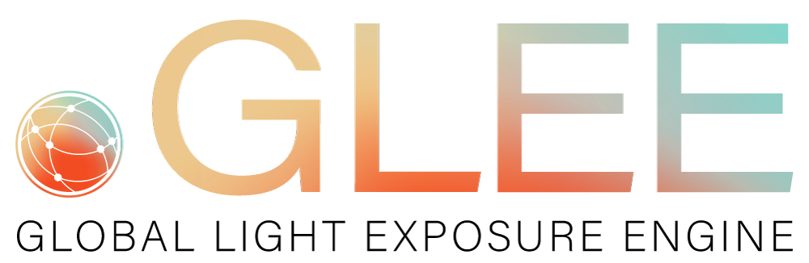
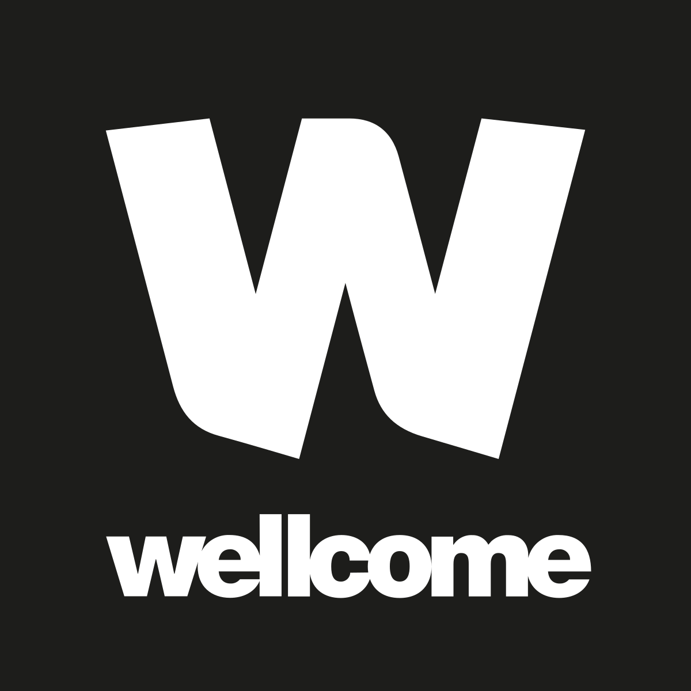

```{r setup}
#| echo: false
library(dplyr)
library(glue)
library(stringr)

course_outcomes <- c(
  "Walk through the LightLogR workflow: import → (pre-)processing → visualisation → metrics.",
  "Sense-check data quickly with tidy, reproducible steps and overview plots.",
  "Handle common issues (gaps, irregular sampling, zero inflation) with principled defaults.",
  "Add photoperiod information and derive interpretable summaries."
)

use_case_outcomes <- list(
  "A Day in Daylight" = c(
    "Setting up imports from multiple devices and time zones.",
    "Handling multi-participant datasets at scale with tidy pipelines.",
    "Joining wearable data with participant demographics and activity logs."
  ),
  "Case of light sensitivity" = c(
    "Merging diary data with light exposure logs.",
    "Calculating metrics anchored to sleep–wake cycles.",
    "Relating light exposure to self-reported sleep, performance, and wellbeing.",
    "Checking compliance with published light-exposure recommendations."
  ),
  "Light therapy" = c(
    "Merging protocol logs with wearable light data.",
    "Analysing exposure by lighting condition and protocol adherence.",
    "Styling advanced tables and plots for sub–day analyses."
  ),
  "Visual experience" = c(
    "Importing multimodal LightLogR datasets (light, distance, spectra, motion).",
    "Reconstructing spectral power distributions and computing spectrum-based metrics.",
    "Simplifying spatial grids, analysing distances, and clustering conditions."
  )
)

selected_use_case <- use_case_outcomes[[params$use_case]] %||% character()
level_label <- str_to_title(params$level)
certificate_seed <- paste(params$participant_name, params$completion_date, params$level, params$use_case)
seed_sum <- sum(utf8ToInt(certificate_seed))
certificate_id <- glue("LLR-{format(Sys.Date(), '%Y%m%d')}-{sprintf('%06X', seed_sum %% 16^6)}")
```

<div style="text-align:center; margin-top:-1em;">
  {width="90%"}
</div>

:::{.callout-tip icon=false collapse=false}
## Certificate of Completion

This certifies that **** successfully completed the **LightLogR webinar series** on **** at the **{{ level_label }}** level.


The participant specialised in the **** use case, focusing on .

:::

### Core learning outcomes

::: {.callout-note icon=false}
```{r}
#| echo: false
cat(paste0("- ", course_outcomes, collapse = "\n"))
```
:::



### Advanced use-case achievements

::: {.callout-important icon=false}
```{r}
#| echo: false
if (length(selected_use_case) == 0) {
  cat("- Custom advanced focus documented by instructors.")
} else {
  cat(paste0("- ", selected_use_case, collapse = "\n"))
}
```
:::




::: {.callout-tip icon=false}
**Beginner track focus:** established a reproducible LightLogR workflow, validated imports, previewed gaps and zero inflation, and created interpretable summaries for personal light-exposure data.
:::



::: {.columns}
::: {.column width="60%"}

#### Signatories

- **Johannes Zauner**, Technical University of Munich & Max Planck Institute for Biological Cybernetics
- **Manuel Spitschan**, Technical University of Munich & Max Planck Institute for Biological Cybernetics

:::

::: {.column width="40%" .justify-right}

<div style="background-color:#f4f5f7; padding:12px; border-left:3pt solid #2D6D66; text-align:center;">
  <div style="font-size:11pt; font-weight:bold; color:#2D6D66;">Verification</div>
  <div style="font-size:9pt; margin-top:4pt;">Certificate ID</div>
  <div style="font-size:10pt; font-family:monospace;">`r certificate_id`</div>
  <div style="font-size:9pt; margin-top:6pt;">Issue Date</div>
  <div style="font-size:10pt;"></div>
</div>

:::
:::

<hr>

<div style="display:flex; justify-content:space-between; align-items:center;">
  <div style="font-size:8pt; color:#555;">Open and reproducible analysis of light exposure and visual experience data</div>
  <div>
    {width="70"}
    {width="90"}
  </div>
</div>
