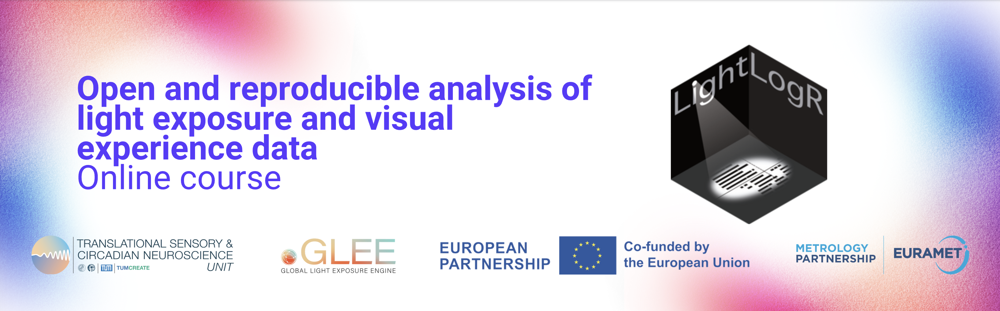
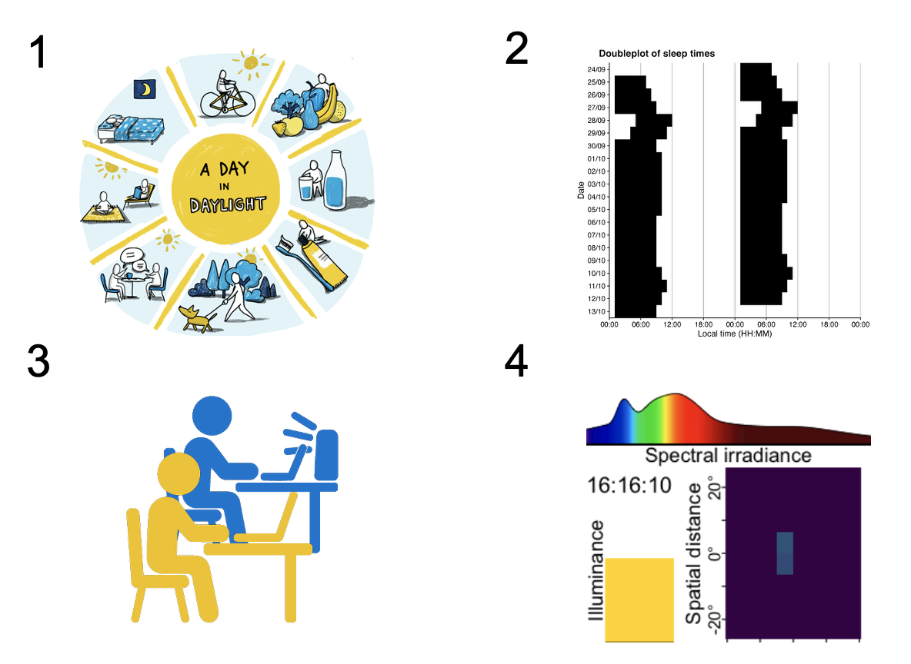

:::{.column-screen}
{width="100%"}
:::

# Welcome to the LightLogR Course Series

Build open, reproducible analyses of wearable light exposure and visual experience data in R. Choose the track that fits your background and goals, then follow along with live, hands‑on examples.

## Choose your track

*Live* tutorials run a self‑contained version of R in your browser - no setup required - with only minor functional limitations. *Static* tutorials provide the complete script exactly as you would run it in a local R installation.

### Beginner

[Beginner (live)](beginner-live.qmd){.btn .btn-primary}
[Beginner (static)](beginner.qmd){.btn .btn-secondary}

A special introduction to data analysis for the [MeLiDos field study](https://github.com/MeLiDosProject) was prepared for the *Tropical light exposure & health seminar*, hosted by the *University of Costa Rica (UCR)*:

[Tropical light exposure & health (live)](tropical_light_exposure_health-live.qmd){.btn .btn-primary}
[Tropical light exposure & health (static)](tropical_light_exposure_health.qmd){.btn .btn-secondary}

### Advanced

The advanced course takes *use cases*, extracted from real-world examples, to highlight advanced analysis techniques. Each use case contains a short summary on the example and on the focus points as a *Preface*.

#### 1. [A Day in Daylight](https://tscnlab.github.io/2025_ADayInDaylight/){target="_blank"}

Analysis challenges: many participants, different devices and time zones, participant metadata, and activity logs

[Advanced (live)](advanced_01_a_day_in_daylight-live.qmd){.btn .btn-primary}
[Advanced (static)](advanced_01_a_day_in_daylight.qmd){.btn .btn-secondary}

#### Case of high light sensitivity

Analysis challenges: sleep-wake-cycles, self-assessments, compliance to Brown et al. (2022) recommendations for healthy light exposure

[Advanced (live)](advanced_02_case_light_sensitivity-live.qmd){.btn .btn-primary}
[Advanced (static)](advanced_02_case_light_sensitivity.qmd){.btn .btn-secondary}

#### Therapy lamps

Analysis challenges: merging protocol logs with wearable data, analysis dependent on lighting conditions, advanced plot & table styling, sub 1-day data

[Advanced (live)](advanced_03_light_therapy-live.qmd){.btn .btn-primary}
[Advanced (static)](advanced_03_light_therapy.qmd){.btn .btn-secondary}

#### Visual experience: beyond light

Analysis challenges: multimodal data, reconstructing light spectra, analysing light spectra, spatial distance data, detecting clusters of conditions

[Advanced (live)](advanced_04_visual_experience-live.qmd){.btn .btn-primary}
[Advanced (static)](advanced_04_visual_experience.qmd){.btn .btn-secondary}

## What you’ll do

- Walk through the LightLogR workflow: import → (pre-)processing → visualisation → metrics.
- Sense‑check data quickly with tidy, reproducible steps and overview plots.
- Handle common issues (gaps, irregular sampling, zero inflation) with principled defaults.
- Add photoperiod information and derive interpretable summaries.

For more information on the two tracks, have a look at the [course flyer](assets/Online_course_series_2025-26.pdf)

::: {.callout-note}
**Prerequisites**

- **Beginner:** Basic familiarity with R; no prior LightLogR experience required.
- **Advanced:** Comfortable with tidy workflows **and** either completion of the beginner track or equivalent LightLogR experience.
:::

## How do I get started?

The tutorials are open to give them a go at any time. Try the *live* tutorials to forego any setup, or download the scripts from the *static* tutorials alongside the data from the [GitHub repository](https://github.com/tscnlab/LightLogR_webinar) for the full experience.

We are also offering free, regular webinars on the topic of *Open and reproducible analysis of light exposure and visual experience data* using `LightLogR`. Have a look at the [course flyer](assets/Online_course_series_2025-26.pdf) and [register here](https://eu02web.zoom-x.de/meeting/register/HVvnEunVTLWr3ei7dwCfZg).

::: {.callout-note}
## Did you miss the last webinar?

No problem, you can watch the [recordings](recordings.qmd) of webinars after the fact. That said, participating in the webinars live gives you the Q&A and also a certificate.

:::

## How to cite this course?


